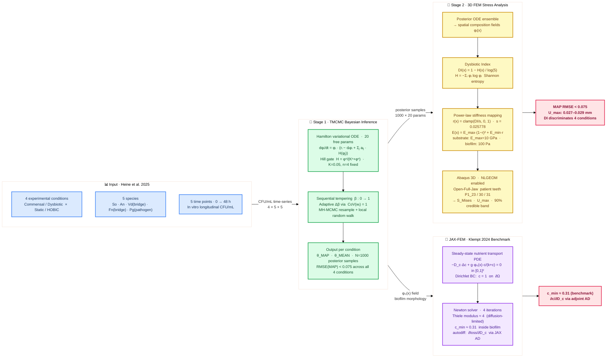

# Tmcmc202601 — 5-Species Oral Biofilm: TMCMC + FEM Pipeline

**5種口腔バイオフィルムのベイズパラメータ推定 (TMCMC) と 3D FEM 応力解析の統合パイプライン**

[](https://github.com/keisuke58/Tmcmc202601/actions/workflows/ci.yml)
[](https://www.python.org/)
[](https://github.com/google/jax)
[](LICENSE)
[](https://github.com/keisuke58/Tmcmc202601/issues)
[](https://github.com/keisuke58/Tmcmc202601/commits/master)

---

## Table of Contents

- [Overview](#overview)
- [Novelty & Contribution](#novelty--contribution)
- [Repository Structure](#repository-structure)
- [TMCMC: Bayesian Parameter Estimation](#tmcmc-bayesian-parameter-estimation)
- [FEM: Stress Analysis Pipeline](#fem-stress-analysis-pipeline)
- [Multiscale Micro→Macro Coupling](#multiscale-micromacro-coupling)
- [Quick Start](#quick-start)
- [Environment](#environment)
- [Key References](#key-references)
- [Contributing & GitHub](#contributing--github)
- [Citation](#citation)

---

## Overview

### Scientific Motivation

Periodontal disease is driven by **dysbiosis** — a community-level shift from a health-associated (commensal) microbiome to a disease-associated one dominated by the keystone pathogen *Porphyromonas gingivalis* (Pg). This shift is enabled by **bridge organisms**: *Veillonella dispar* (Vd) facilitates Pg via lactate cross-feeding and pH modulation, and *Fusobacterium nucleatum* (Fn) provides structural coaggregation scaffolding. Quantifying these ecological interactions is essential to understanding how dysbiosis develops.

This project addresses two coupled questions:

1. **Ecology**: How do species interaction strengths (*a*ᵢⱼ) differ between commensal and dysbiotic oral communities, and across cultivation methods (Static vs. HOBIC)?
2. **Mechanics**: How does the inferred community composition alter the effective stiffness and stress distribution in periodontal tissue?

### Pipeline

Periodontal disease is driven by **dysbiosis** — a community-level shift from a health-associated (commensal) microbiome to a disease-associated one dominated by the keystone pathogen *Porphyromonas gingivalis* (Pg). This shift is enabled by **bridge organisms**: *Veillonella dispar* (Vd) facilitates Pg via lactate cross-feeding and pH modulation, and *Fusobacterium nucleatum* (Fn) provides structural coaggregation scaffolding. Quantifying these ecological interactions is essential to understanding how dysbiosis develops.

This project addresses two coupled questions:

1. **Ecology**: How do species interaction strengths (*a*ᵢⱼ) differ between commensal and dysbiotic oral communities, and across cultivation methods (Static vs. HOBIC)?
2. **Mechanics**: How does the inferred community composition alter the effective stiffness and stress distribution in periodontal tissue?

### Pipeline


 In vitro longitudinal data (4 conditions × 5 species × 5 time points)
           │   Commensal/Dysbiotic × Static/HOBIC  [Heine et al. 2025]
           ▼
 ┌─────────────────────────────────────┐
 │  Stage 1 — TMCMC Bayesian Inference │
 │                                     │
 │  Hamilton ODE  (5-species, 20 θ)    │
 │  p(θ|data) via sequential tempering │
 │  → θ_MAP, θ_MEAN, posterior samples │
 └────────────────┬────────────────────┘
                  │  posterior samples per condition
                  ▼
 ┌─────────────────────────────────────┐
 │  Stage 2 — 3D FEM Stress Analysis   │
 │                                     │
 │  φᵢ(x) composition fields           │
 │  → Dysbiotic Index  DI(x)           │
 │  → E(DI) power-law mapping          │
 │  → Abaqus 3D FEM                    │
 │  → S_Mises, U  (substrate / EPS)    │
 └─────────────────────────────────────┘
```

### Four Experimental Conditions

| Condition | Role | Biological Interpretation |
|-----------|------|--------------------------|
| **Commensal Static** | Negative control | Health-associated community; Pg suppressed |
| **Commensal HOBIC** | Negative control | Health-associated + fluid shear; Pg suppressed |
| **Dysbiotic Static** | Partial control | Pg present but no HOBIC-driven surge |
| **Dysbiotic HOBIC** | **Target** | Pg "surge" via Vd→Pg and Fn→Pg facilitation |

HOBIC (High-flow Open Biofilm Incubation Chamber) mimics oral shear forces that accelerate pathogen colonisation.

### Five Species

| Abbr. | Species | Role |
|-------|---------|------|
| So | *Streptococcus oralis* | Early coloniser; health-associated |
| An | *Actinomyces naeslundii* | Early coloniser; health-associated |
| Vd | *Veillonella dispar* | Bridge organism — pH modulation → Pg facilitation |
| Fn | *Fusobacterium nucleatum* | Bridge organism — coaggregation scaffold |
| Pg | *Porphyromonas gingivalis* | Keystone periodontal pathogen |


*Fig. 1 — Inferred 5-species interaction network. Positive weights (blue) indicate facilitation; negative (red) indicate inhibition. Bridge species Vd and Fn mediate Pg colonisation.*

---

## Novelty & Contribution

> 口腔バイオフィルムの種間相互作用パラメータをベイズ推定し、その事後分布を 3D FEM 応力解析まで一貫して伝播する、マルチスケール計算フレームワーク。

### 研究の位置づけ

歯周病の発症機序において、commensal → dysbiotic への菌叢遷移（polymicrobial synergy and dysbiosis; PSD モデル [Hajishengallis & Lamont 2012]）が鍵を握る。しかし既存研究には以下の 2 つのギャップがある：

1. **種間相互作用の定量化が不十分** — 16S rRNA シーケンシングや共培養実験は「菌 A–B 間に相関がある」という定性的知見に留まり、相互作用強度 *a*ᵢⱼ の事後分布を推定した研究はない
2. **微生物生態と組織力学の断絶** — バイオフィルムの構成論的モデル（e.g., Klempt et al. 2024）と歯周組織の FEM 解析は別々に発展してきたが、**推定パラメータの不確かさを力学応答まで伝播するフレームワーク**は存在しない

### 4 つの新規性

#### 1. Hamilton 変分 ODE + TMCMC による種間相互作用の確率的同定

Klempt et al. (2024) の Hamilton 原理に基づく 5 種バイオフィルム ODE に対し、TMCMC（Ching & Chen 2007）による逐次テンパリングベイズ推定を適用。20 パラメータの同時事後分布を取得する。

- **Hill ゲート** H(φ) = φⁿ/(Kⁿ+φⁿ) による非線形相互作用の導入で、bridge organism（Vd, Fn）→ keystone pathogen（Pg）の促進機構をモデル化
- MAP 推定値だけでなく **N=1000 の事後サンプル** を保持 → 下流の全解析に不確かさを伝播
- 4 条件（Commensal/Dysbiotic × Static/HOBIC）すべてで MAP RMSE < 0.075 を達成

#### 2. 微生物生態 → 組織力学のエンドツーエンドパイプライン

```
In vitro CFU データ (Heine et al. 2025)
  → TMCMC: θ_MAP, {θ⁽ⁱ⁾}ᵢ₌₁ᴺ  (20-dim 事後分布)
    → Hamilton ODE → 空間菌組成場 φᵢ(x)
      → Dysbiotic Index: DI(x) = 1 − H(x)/ln 5
        → 構成則マッピング: E(x) = E_max(1−r)² + E_min·r
          → Abaqus 3D FEM (Open-Full-Jaw patient mesh)
            → σ_Mises(x), U(x) + 90% credible band
```

CFU 計測値から応力場の信用区間まで**単一の自動化パイプライン**で接続する点が、従来の単一スケール研究との本質的な違いである。

#### 3. 事後分布の FEM への完全伝播（End-to-End Uncertainty Propagation）

TMCMC 事後サンプル {θ⁽ⁱ⁾} を ODE → DI → E(x) → FEM に順伝播し、応力場の **90% credible interval** を構成する。決定論的最適化（NLS 等）では点推定しか得られず、この定量的不確かさ評価は不可能である。具体的には：

- DI フィールドの条件間差異を信用区間付きで議論可能
- von Mises 応力の分散が最も大きい空間領域を同定 → 実験デザインへのフィードバック

#### 4. 栄養場–菌組成の空間連成によるマルチスケール固有ひずみ場

Hamilton ODE を反応拡散 PDE（Monod 型消費項 + Fick 拡散）と連成し、**栄養場 c(x) に依存した空間非一様な成長固有ひずみ** ε(x) を導出する。

- Monod 活性: α(x) = k_α ∫₀ᵀ φ_total · c/(k+c) dt → 固有ひずみ ε = α/3
- 結果：唾液側 ε ≈ 0.14（14% 体積膨張）、歯面側 ε ≈ 0.001（栄養枯渇で成長停止）、空間勾配 **~100×**
- この ε(x) を熱膨張アナロジーとして Abaqus INP に入力 → 空間的に非均一な残留応力場を生成

### 従来研究との比較

| 観点 | 従来の研究 | 本研究 |
|------|-----------|--------|
| 種間相互作用の推定 | 相関解析・定性的記述 | **Hamilton ODE + TMCMC による事後分布推定** |
| 力学解析の材料入力 | 均一定数（文献値） | **DI(x) に基づく空間変動構成則** |
| 不確かさの扱い | 点推定（感度解析のみ） | **事後分布の順伝播 → 応力の credible interval** |
| スケール連成 | 単一スケール | **ODE（0D）→ 反応拡散 PDE（1D/2D）→ FEM（3D）** |
| 固有ひずみ | 均一または未考慮 | **栄養場依存の空間非一様固有ひずみ** |

---

## Repository Structure

```
Tmcmc202601/
├── data_5species/          # TMCMC estimation pipeline
│   ├── core/               # TMCMC engine, evaluator, model ODE
│   ├── main/               # Entry points (estimate_reduced_nishioka.py)
│   ├── model_config/       # Prior bounds, model configuration JSON
│   └── _runs/              # Run outputs (theta_MAP, posterior samples)
│
├── FEM/                    # FEM stress analysis pipeline
│   ├── abaqus_biofilm_*.py # Abaqus INP generators (isotropic/aniso/CZM)
│   ├── biofilm_conformal_tet.py   # Conformal tet mesh + --mode biofilm/substrate
│   ├── jax_fem_reaction_diffusion_demo.py  # JAX-FEM Klempt 2024 demo
│   ├── jax_pure_reaction_diffusion_demo.py # Pure JAX PDE demo (egg morphology)
│   ├── jax_hamilton_*.py   # Hamilton PDE demos (0D / 1D)
│   ├── JAXFEM/             # JAX-based FEM modules
│   ├── klempt2024_gap_analysis.md  # Gap analysis vs Klempt (2024)
│   ├── FEM_README.md       # Detailed FEM pipeline documentation
│   └── _*/                 # Output directories (results, sweeps, plots)
│
├── tmcmc/                  # Core TMCMC library
├── docs/                   # LaTeX reports and slides
├── run_bridge_sweep.py     # Parameter sweep runner
├── analyze_sweep_results.py
└── PROJECT_SUMMARY.md      # Full progress summary (JP)
```

---

## TMCMC: Bayesian Parameter Estimation

### Model

- **ODE system**: 5-species Hamilton principle biofilm (20 parameters)
- **Inference**: Transitional Markov Chain Monte Carlo (TMCMC)
- **Prior**: Uniform with physiologically motivated bounds
- **Hill gate**: interaction nonlinearity (K_hill, n_hill fixed)

### Key Parameters

| Index | Symbol | Meaning |
|-------|--------|---------|
| θ[18] | a₃₅ | *V. dispar* → *P. gingivalis* facilitation |
| θ[19] | a₄₅ | *F. nucleatum* → *P. gingivalis* facilitation |
| θ[12] | a₂₃ | *S. oralis* → *A. naeslundii* cross-feeding |

### Best Runs — All 4 Conditions (2026-02-08, 1000 particles, ~90 h)

MAP RMSE per species:

| Species | Comm. Static | Comm. HOBIC | Dysb. Static | Dysb. HOBIC |
|---------|:---:|:---:|:---:|:---:|
| *S. oralis* | 0.0935 | 0.1044 | 0.0256 | 0.0416 |
| *A. naeslundii* | 0.0422 | 0.0807 | 0.0566 | 0.0706 |
| *V. dispar* | 0.0604 | 0.0458 | 0.0748 | 0.1069 |
| *F. nucleatum* | 0.0210 | 0.0137 | 0.0291 | 0.0807 |
| *P. gingivalis* | 0.0191 | 0.0169 | 0.0645 | 0.0562 |
| **Total MAP RMSE** | **0.0547** | **0.0632** | **0.0538** | **0.0746** |

Run directories: `_runs/Commensal_Static_20260208_002100`, `_runs/Commensal_HOBIC_20260208_002100`, `_runs/Dysbiotic_Static_20260207_203752`, `_runs/Dysbiotic_HOBIC_20260208_002100`

### MAP Posterior Fit — Dysbiotic HOBIC (Target Condition)


*Fig. 2 — MAP estimate vs. measured data (Dysbiotic HOBIC). Solid lines: model trajectory; markers: in vitro measurements (Heine et al. 2025). The Pg "surge" driven by bridge organisms is well-captured.*

### Posterior Predictive Uncertainty


*Fig. 3 — Posterior predictive band (Dysbiotic HOBIC). Shaded region: 90% credible interval from 1000 posterior samples. The uncertainty is tightest for the dominant commensal species (So, An) and widest for the bridge organisms.*

### Interaction Heatmap


*Fig. 4 — Inferred interaction matrix (Dysbiotic HOBIC). Rows = influenced species, columns = influencing species. Large positive a₃₅ (Vd→Pg) and a₄₅ (Fn→Pg) quantify bridge-mediated dysbiosis.*

---

## FEM: Stress Analysis Pipeline

### Tooth Geometry — Open-Full-Jaw Dataset

Patient-specific lower-jaw (mandible) STL meshes are taken from the **Open-Full-Jaw** open-access dataset [Gholamalizadeh et al. 2022]:

- 17 patient-specific models derived from CBCT scans (mandible + maxilla + teeth + PDL)
- Volumetric meshes generated with **fTetWild**; PDL gap thickness ≈ 0.2 mm
- This project uses teeth from **Patient 1** (lower jaw): `P1_Tooth_23`, `P1_Tooth_30`, `P1_Tooth_31`
- Source: `FEM/external_tooth_models/Open-Full-Jaw-main/`

### Dysbiotic Index → Stiffness Mapping

```
DI(x) = 1 − H(x) / log(5)         H = Shannon entropy of species mix
r(x)  = clamp(DI(x) / s, 0, 1)    s = 0.025778
E(x)  = E_max · (1−r)ⁿ + E_min · r
```

Default: E_max = 10 GPa (commensal), E_min = 0.5 GPa (dysbiotic), n = 2

### Analysis Modes

| Mode | Scale | Purpose |
|------|-------|---------|
| `--mode substrate` | GPa | Dental substrate effective stiffness; S_Mises is primary metric |
| `--mode biofilm` | Pa | EPS matrix (Klempt 2024); U_max is primary metric |
| `--neo-hookean` | Pa | Neo-Hookean hyperelastic for large strains (biofilm mode) |

### Biofilm Mode Results (4 conditions, NLGEOM, 2026-02-23)

| Condition | DI_mean | E_mean (Pa) | U_max (mm) |
|-----------|---------|------------|------------|
| dh_baseline | 0.00852 | 451 | 0.0267 |
| dysbiotic_static | 0.00950 | 403 | 0.0286 |
| commensal_static | 0.00971 | 392 | 0.0290 |
| commensal_hobic | 0.00990 | 383 | **0.0294** (+10%) |

→ Displacement (not stress) discriminates conditions under pressure-controlled BC.

### 3D Composition Fields — Pg Overview (All 4 Conditions)


*Fig. 5 — Spatial distribution of P. gingivalis (φ_Pg) across all 4 experimental conditions, 3D tooth model. The dysbiotic HOBIC condition (bottom-right) shows highest Pg penetration depth into the biofilm.*

### Dysbiotic Index — Cross-Condition Comparison


*Fig. 6 — Dysbiotic Index (DI) depth profiles with 90% credible intervals across all 4 conditions. Higher DI values indicate more dysbiotic community composition.*

### Posterior Stress Uncertainty


*Fig. 7 — Posterior uncertainty in von Mises stress across the 4 experimental conditions. Uncertainty is propagated from TMCMC posterior samples through the DI→E mapping into Abaqus FEM.*

### JAX-FEM Demos (Klempt 2024 benchmark)

`FEM/jax_fem_reaction_diffusion_demo.py` implements the steady-state nutrient transport PDE from Klempt et al. (2024):

```
−D_c Δc + g φ₀(x) c/(k+c) = 0    in Ω = [0,1]²
c = 1                               on ∂Ω
```

- Egg-shaped biofilm morphology φ₀ (Klempt 2024 Fig. 1): ax=0.35, ay=0.25, skew=0.3
- Thiele modulus ~4 (diffusion-limited regime)
- Result: c_min ≈ 0.31 inside biofilm; Newton converges in 4 iterations
- Full JAX autodiff: ∂(loss)/∂D_c demonstrated

---

## Multiscale Micro→Macro Coupling

> **Added 2026-02-24** — bridges the 0D/1D ODE ecology model with spatially non-uniform eigenstrain fields for Abaqus.

### Concept

The TMCMC posterior gives a *mean-field* community composition θ. The multiscale pipeline turns this into a **spatially varying growth eigenstrain** ε(x) that can be imported into any FEM solver:

```
TMCMC θ_MAP
    │
    ├─► 0D JAX ODE (T*=25, n=2500 steps)
    │       → DI_0D     commensal≈0.05,  dysbiotic≈0.84  (17× difference)
    │       → α_0D      condition-specific activity scalar
    │
    └─► 1D Hamilton + Nutrient PDE (N=30 nodes, T*=20)
            → c(x,T)    nutrient field  (decays from saliva→tooth surface)
            → φᵢ(x,T)   species profiles
            │
            ▼
        α_Monod(x) = k_α ∫ φ_total · c/(k+c) dt     [KEY spatial bridge]
        ε_growth(x) = α_Monod(x) / 3                  [volumetric eigenstrain]
            │
            ▼
        Abaqus T3D2 bar element INP
        → spatially non-uniform thermal-analogy eigenstrain field
```

### Key Numerical Results (2026-02-24)

| Quantity | Commensal | Dysbiotic | Ratio |
|----------|:---------:|:---------:|:-----:|
| DI_0D | 0.047 | 0.845 | **18×** |
| α_Monod at tooth surface (x=0) | 0.004 | 0.004 | ≈1× |
| α_Monod at saliva side (x=1) | 0.420 | 0.420 | ≈1× |
| Spatial gradient (x=1 / x=0) | **101×** | **101×** | — |
| ε_growth at x=1 | 0.14 (14%) | 0.14 (14%) | — |
| E_eff (Pa, from DI) | **~909** | **~33** | **28×** |

> The spatial gradient in ε_growth is driven by nutrient depletion c(x): the biofilm interior (tooth surface, x=0) is nutrient-starved and barely grows, while the saliva-exposed outer layer (x=1) grows at 14% volumetric strain.

### Implementation Files

| File | Purpose |
|------|---------|
| `FEM/multiscale_coupling_1d.py` | Full 0D+1D pipeline → α_Monod(x) CSV |
| `FEM/generate_hybrid_macro_csv.py` | Hybrid: 0D DI scalar × 1D spatial α |
| `FEM/generate_abaqus_eigenstrain.py` | T3D2 bar INP with thermal eigenstrain |
| `FEM/generate_pipeline_summary.py` | 9-panel summary figure |

### Quick Run

```bash
~/.pyenv/versions/miniconda3-latest/envs/klempt_fem/bin/python \
    FEM/multiscale_coupling_1d.py
# → FEM/_multiscale_results/macro_eigenstrain_{commensal,dysbiotic}.csv
# → FEM/_multiscale_results/multiscale_comparison.png

~/.pyenv/versions/miniconda3-latest/envs/klempt_fem/bin/python \
    FEM/generate_abaqus_eigenstrain.py
# → FEM/_abaqus_input/biofilm_1d_bar_{commensal,dysbiotic}.inp
```

---

## Quick Start

### TMCMC Estimation

```bash
cd Tmcmc202601
python data_5species/main/estimate_reduced_nishioka.py \
    --n-particles 150 --n-stages 8 \
    --lambda-pg 2.0 --lambda-late 1.5
```

### FEM Stress Analysis

```bash
cd Tmcmc202601/FEM

# Posterior ensemble → DI fields → Abaqus stress
python run_posterior_abaqus_ensemble.py
python aggregate_di_credible.py
python run_material_sensitivity_sweep.py

# Biofilm mode (Pa-scale EPS, NLGEOM)
python biofilm_conformal_tet.py \
    --stl external_tooth_models/.../P1_Tooth_23.stl \
    --di-csv abaqus_field_dh_3d.csv \
    --out p23_biofilm.inp --mode biofilm
```

### JAX-FEM Klempt 2024 Demo

```bash
# klempt_fem conda env (Python 3.11, jax-fem 0.0.11)
~/.pyenv/versions/miniconda3-latest/envs/klempt_fem/bin/python \
    FEM/jax_fem_reaction_diffusion_demo.py
# → FEM/klempt2024_results/klempt2024_nutrient.vtu + .png
```

---

## Environment

| Component | Version / Path |
|-----------|---------------|
| Python (TMCMC) | system Python 3.x |
| Python (JAX-FEM) | klempt_fem conda env (Python 3.11) |
| JAX | 0.9.0.1 (x64 enabled) |
| jax-fem | 0.0.11 |
| Abaqus | 2023 (HPC cluster) |

---

## Key References

### Tooth Geometry & Jaw FEM
- **Gholamalizadeh et al. (2022)**: *Open-Full-Jaw: An open-access dataset and pipeline for finite element models of human jaw*, Comput Methods Programs Biomed 224:107009. [DOI](https://doi.org/10.1016/j.cmpb.2022.107009) — source of patient-specific mandible/tooth STL meshes used in this project
- **McCormack et al. (2017)**: *Inclusion of periodontal ligament fibres in mandibular finite element models leads to an increase in alveolar bone strains*, PLOS ONE — PDL fibre modelling effect on mandibular strain
- **Gröning et al. (2011)**: *The effects of the periodontal ligament on mandibular stiffness*, J Biomech — PDL contribution to jaw mechanical behaviour

### Biofilm Mechanics & FEM
- **Klempt, Soleimani, Wriggers, Junker (2024)**: *A Hamilton principle-based model for diffusion-driven biofilm growth*, Biomech Model Mechanobiol 23:2091–2113. [DOI](https://doi.org/10.1007/s10237-024-01883-x)
- **Junker & Balzani (2021)**: Extended Hamilton principle for dissipative continua (thermodynamic framework underlying the ODE model)
- **Soleimani et al. (2016, 2019)**: Periodontal ligament FEM with GPa-scale effective stiffness
- **Billings et al. (2015)**: EPS matrix stiffness E ≈ 10 Pa (biofilm mode reference)
- **Fritsch, Geisler et al. (2025)**: Bayesian model updating for biofilm constitutive parameters under hybrid uncertainties

### Microbiology & Experimental Data
- **Heine et al. (2025)**: Original paper describing 5-species oral biofilm interaction network (Fig. 4C); source of in vitro data used for TMCMC calibration

### Bayesian Inference
- **Ching & Chen (2007)**: Transitional Markov Chain Monte Carlo (TMCMC) algorithm

---

## Contributing & GitHub

See [CONTRIBUTING.md](CONTRIBUTING.md) for contribution guidelines.

| Resource | Link |
|----------|------|
| **Issues** — bug reports, feature requests | [github.com/…/issues](https://github.com/keisuke58/Tmcmc202601/issues) |
| **Discussions** — questions, ideas | [github.com/…/discussions](https://github.com/keisuke58/Tmcmc202601/discussions) |
| **Projects** — roadmap & task board | [github.com/…/projects](https://github.com/keisuke58/Tmcmc202601/projects) |
| **Wiki** — extended documentation | [github.com/…/wiki](https://github.com/keisuke58/Tmcmc202601/wiki) |
| **Actions** — CI status | [github.com/…/actions](https://github.com/keisuke58/Tmcmc202601/actions) |
| **Pages** — project site | [keisuke58.github.io/Tmcmc202601](https://keisuke58.github.io/Tmcmc202601) |

### CI

A smoke-test workflow (`.github/workflows/ci.yml`) runs on every push / pull request to `main` / `master`:

- Syntax check on `core/` modules (`py_compile`)
- Import test: verifies `INTERACTION_GRAPH_JSON` structure and Nishioka interaction mask

---

## Citation

If you use this code or data in your research, please cite:

```bibtex
@software{nishioka2026tmcmc,
  author    = {Nishioka, Keisuke},
  title     = {Tmcmc202601: 5-Species Oral Biofilm TMCMC + FEM Pipeline},
  year      = {2026},
  url       = {https://github.com/keisuke58/Tmcmc202601},
  note      = {Keio University / IKM Leibniz Universität Hannover}
}
```

See also [CITATION.cff](CITATION.cff) for machine-readable citation metadata.

---

## Author

Nishioka — Keio University / IKM Leibniz Universität Hannover, 2026
