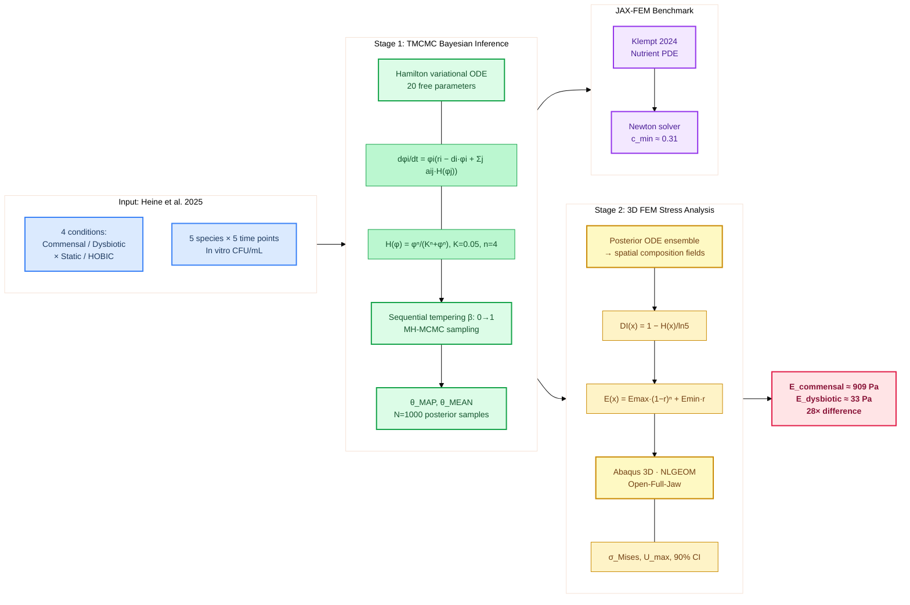
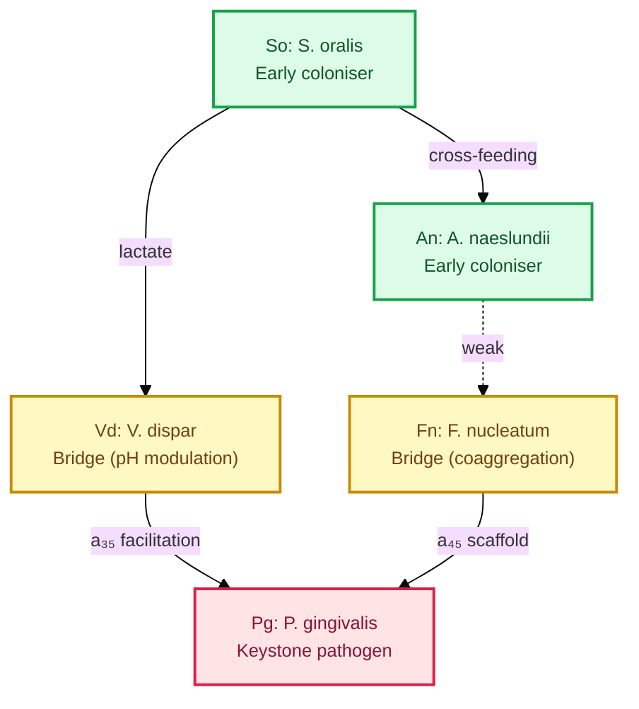
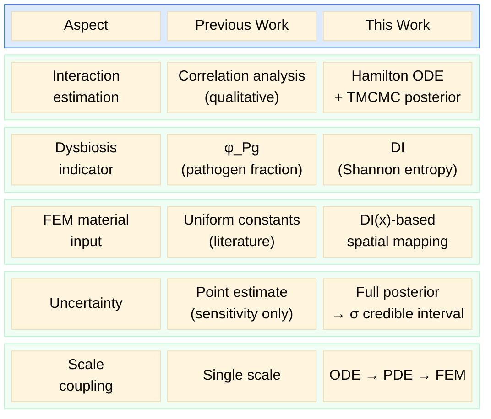
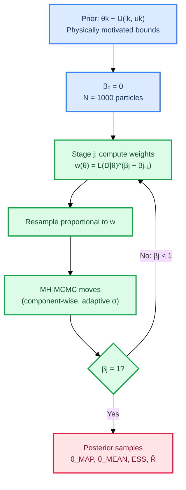
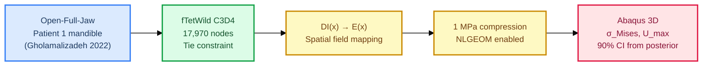
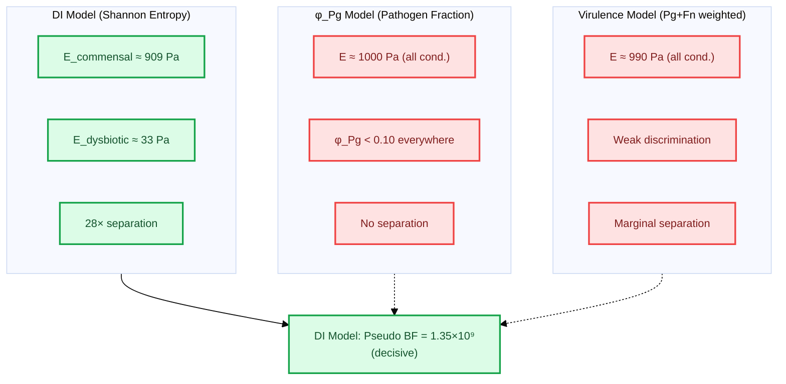
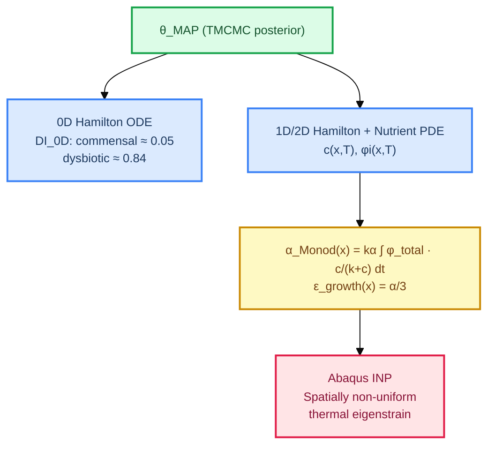

# Bayesian Identification of Interspecies Interaction Parameters in a 5-Species Oral Biofilm Model and Propagation of Posterior Uncertainty to 3D Finite Element Stress Analysis

**5種口腔バイオフィルム Hamilton ODE モデルにおける種間相互作用パラメータの TMCMC ベイズ同定と、事後分布の 3D FEM 応力解析への伝播**

[](https://github.com/keisuke58/Tmcmc202601/actions/workflows/lint.yml)
[](https://github.com/keisuke58/Tmcmc202601/actions/workflows/test.yml)
[](https://github.com/keisuke58/Tmcmc202601/actions/workflows/codeql.yml)
[](https://github.com/keisuke58/Tmcmc202601/actions/workflows/latex-build.yml)
[](https://www.python.org/)
[](https://github.com/google/jax)
[](LICENSE)
[](https://github.com/keisuke58/Tmcmc202601/issues)
[](https://github.com/keisuke58/Tmcmc202601/commits/master)

---

## Table of Contents

- [日本語要約](#日本語要約)
- [Overview](#overview)
- [Novelty & Contribution](#novelty--contribution)
- [Repository Structure](#repository-structure)
- [TMCMC: Bayesian Parameter Estimation](#tmcmc-bayesian-parameter-estimation)
- [FEM: Stress Analysis Pipeline](#fem-stress-analysis-pipeline)
- [Multiscale Coupling](#multiscale-micromacro-coupling)
- [Quick Start](#quick-start)
- [Limitations](#limitations--known-constraints)
- [References](#references)
- [Citation](#citation)

---

## 日本語要約

歯周病は、口腔バイオフィルム内の菌叢遷移（dysbiosis）— 健康関連菌から病原性菌への群集レベルの移行 — によって駆動される。本研究では、Heine et al. (2025) の 5 種バイオフィルム in vitro 実験データ（4 条件 × 5 時間点）に対して、以下の 2 段階パイプラインを構築・実行する。

1. **Stage 1 — TMCMC ベイズ推定**: Klempt et al. (2024) の Hamilton 変分 ODE（20 パラメータ）に TMCMC を適用し、相互作用強度 $a_{ij}$ の事後分布を 1000 サンプルとして取得。Hill ゲート関数により bridge organism → Pg の非線形促進をモデル化。
2. **Stage 2 — FEM 応力解析**: Shannon エントロピーベースの Dysbiotic Index (DI) を経由して空間変動ヤング率 $E(\mathbf{x})$ にマッピングし、Abaqus 3D FEM で von Mises 応力場と 90% 信用区間を算出。

**主要結果**: commensal vs dysbiotic で弾性率 **28 倍差** (909 Pa vs 33 Pa)、Pg RMSE **76% 改善**、Pseudo Bayes Factor **1.35×10⁹**（DI モデルが decisive に優位）。

---

## Overview

### Scientific Motivation

Periodontal disease is driven by **dysbiosis** — a community-level shift from a health-associated (commensal) microbiome to one dominated by the keystone pathogen *Porphyromonas gingivalis* (Pg). This shift is enabled by **bridge organisms**: *Veillonella dispar* (Vd) facilitates Pg via lactate cross-feeding, and *Fusobacterium nucleatum* (Fn) provides coaggregation scaffolding.

This project addresses two coupled questions:

1. **Ecology**: How do species interaction strengths $a_{ij}$ differ between commensal and dysbiotic communities?
2. **Mechanics**: How does the inferred community composition alter the effective stiffness and stress in periodontal tissue?

### Pipeline



### Four Experimental Conditions

| Condition | Role | Biological Interpretation |
|-----------|------|--------------------------|
| **Commensal Static** | Negative control | Health-associated community; Pg suppressed |
| **Commensal HOBIC** | Negative control | Health-associated + fluid shear |
| **Dysbiotic Static** | Partial control | Pg present but no HOBIC-driven surge |
| **Dysbiotic HOBIC** | **Target** | Pg "surge" via bridge organism facilitation |

HOBIC (High-flow Open Biofilm Incubation Chamber) mimics oral shear forces that accelerate pathogen colonisation.

### Five Species



---

## Novelty & Contribution

### 1. Hamilton ODE + TMCMC による種間相互作用の確率的同定

Klempt et al. (2024) の Hamilton 原理 ODE に対し TMCMC ベイズ推定を適用。Hill ゲート $H(\varphi) = \varphi^n/(K^n + \varphi^n)$ で bridge organism → Pg の非線形促進をモデル化し、20 パラメータの同時事後分布を取得する。

### 2. 微生物生態 → 組織力学のエンドツーエンドパイプライン

$$
\underbrace{\text{In vitro CFU}}_{\text{Heine 2025}}
\;\xrightarrow{\text{TMCMC}}\;
\hat{\boldsymbol{\theta}}_{\text{MAP}},\;\{\boldsymbol{\theta}^{(i)}\}
\;\xrightarrow{\text{ODE}}\;
\varphi_i(\mathbf{x})
\;\xrightarrow{\text{DI}}\;
E(\mathbf{x})
\;\xrightarrow{\text{FEM}}\;
\sigma_{\text{Mises}} \pm \text{90\% CI}
$$

### 3. 事後分布の FEM への完全伝播

TMCMC 事後サンプルを ODE → DI → $E(\mathbf{x})$ → FEM に順伝播し、応力場の 90% credible interval を構成。決定論的最適化では不可能な定量的不確かさ評価を実現。

### 4. DI (エントロピー) vs $\varphi_\text{Pg}$

Hamilton ODE では全条件で $\varphi_\text{Pg} < 0.10$ → 条件間の区別不可。**DI は多様性の喪失を検出**し、commensal (DI ≈ 0.05) と dysbiotic (DI ≈ 0.84) を明確に分離。Pseudo BF = 1.35×10⁹ で DI モデルが decisive に優位。



---

## Repository Structure

```
Tmcmc202601/
├── data_5species/             # Stage 1: TMCMC estimation
│   ├── core/                  #   TMCMC engine, evaluator, Hamilton ODE
│   ├── main/                  #   Entry point: estimate_reduced_nishioka.py
│   ├── model_config/          #   Prior bounds (JSON)
│   ├── experiment_data/       #   Raw CFU/mL data (Heine et al. 2025)
│   └── _runs/                 #   θ_MAP, posterior samples per condition
│
├── FEM/                       # Stage 2: FEM stress analysis
│   ├── biofilm_conformal_tet.py       # Conformal tet mesh generator
│   ├── generate_paper_figures.py      # Paper figures (Fig 8–15)
│   ├── multiscale_coupling_{1,2}d.py  # 0D+1D/2D multiscale pipeline
│   ├── generate_abaqus_eigenstrain.py # Abaqus INP with thermal eigenstrain
│   ├── material_models.py            # DI → E(x) constitutive mapping
│   ├── JAXFEM/                        # JAX-FEM modules
│   └── external_tooth_models/         # Open-Full-Jaw STL (Git LFS)
│
├── deeponet/                  # DeepONet surrogate (~80× per-sample, ~29× E2E TMCMC)
│   ├── deeponet_hamilton.py   #   Equinox-based DeepONet
│   ├── generate_training_data.py  # Importance sampling data gen
│   └── checkpoints_*/         #   Trained models
│
├── tmcmc/                     # Core TMCMC library
├── docs/                      # LaTeX reports & slides
├── _tests/                    # Test suite
└── Makefile                   # Build targets (make help)
```

---

## TMCMC: Bayesian Parameter Estimation

### Governing Equations

$$
\frac{d\varphi_i}{dt} = \varphi_i \left( r_i - d_i \varphi_i + \sum_{j \neq i} a_{ij} H(\varphi_j) \right), \quad H(\varphi) = \frac{\varphi^n}{K^n + \varphi^n}
$$

20 free parameters: growth rates $r_i$, self-inhibition $d_i$, interaction coefficients $a_{ij}$ (selected pairs). Hill gate fixed at $K = 0.05$, $n = 4$.

### TMCMC Algorithm



### Parameter Space (20 dims)

| Category | Parameters | Count |
|----------|-----------|-------|
| Growth rates | $r_1, \ldots, r_5$ | 5 |
| Self-inhibition | $d_1, \ldots, d_5$ | 5 |
| Interactions | $a_{ij}$ (selected pairs) | 10 |

Key interactions: $a_{35}$ (Vd→Pg, $\theta_{18}$), $a_{45}$ (Fn→Pg, $\theta_{19}$)

### Results — All 4 Conditions (1000 particles, ~90 h)

MAP RMSE per species:

| Species | Comm. Static | Comm. HOBIC | Dysb. Static | Dysb. HOBIC |
|---------|:---:|:---:|:---:|:---:|
| *S. oralis* | 0.094 | 0.104 | 0.026 | 0.042 |
| *A. naeslundii* | 0.042 | 0.081 | 0.057 | 0.071 |
| *V. dispar* | 0.060 | 0.046 | 0.075 | 0.107 |
| *F. nucleatum* | 0.021 | 0.014 | 0.029 | 0.081 |
| *P. gingivalis* | 0.019 | 0.017 | 0.065 | 0.056 |
| **Total** | **0.055** | **0.063** | **0.054** | **0.075** |

### Mild-Weight Prior Improvement

$a_{35}$ bounds [0, 30] → [0, 5] + likelihood weighting ($\lambda_\text{Pg} = 2.0$, $\lambda_\text{late} = 1.5$):

| Metric | Original | Mild-weight | Change |
|--------|:---:|:---:|:---:|
| $a_{35}$ (MAP) | 17.3 (non-physical) | **3.56** | Physical |
| Pg RMSE | 0.413 | **0.103** | **−75%** |
| Total RMSE | 0.223 | **0.156** | **−30%** |

---

## FEM: Stress Analysis Pipeline

### Dysbiotic Index → Stiffness Mapping

$$
\mathrm{DI}(\mathbf{x}) = 1 - \frac{H(\mathbf{x})}{\ln 5}, \qquad
E(\mathbf{x}) = E_{\max}(1 - r)^n + E_{\min} \cdot r, \quad r = \mathrm{clamp}(\mathrm{DI}/s,\; 0,\; 1)
$$

- DI = 0: equal diversity (healthy) → DI = 1: single-species dominance (dysbiotic)
- $E_{\max} = 1000$ Pa (commensal), $E_{\min} = 10$ Pa (dysbiotic)

### FEM Configuration



### Biofilm Mode Results

| Condition | $\overline{\mathrm{DI}}$ | $\bar{E}$ (Pa) | $U_{\max}$ (mm) |
|-----------|---------|------------|------------|
| Dysbiotic HOBIC | 0.00852 | 451 | 0.0267 |
| Dysbiotic Static | 0.00950 | 403 | 0.0286 |
| Commensal Static | 0.00971 | 392 | 0.0290 |
| Commensal HOBIC | 0.00990 | 383 | 0.0294 |

### 3-Model Comparison: DI vs $\varphi_\text{Pg}$ vs Virulence



See [FEM/FEM_README.md](FEM/FEM_README.md) for detailed pipeline documentation.

---

## Multiscale Micro→Macro Coupling

The TMCMC posterior gives a mean-field composition. The multiscale pipeline turns this into a **spatially varying growth eigenstrain** for FEM:



$$
\alpha_{\text{Monod}}(\mathbf{x})
= k_\alpha \int_0^{T} \varphi_{\text{total}} \cdot \frac{c}{k + c}\,\mathrm{d}t,
\qquad
\varepsilon_{\text{growth}}(\mathbf{x}) = \frac{\alpha_{\text{Monod}}}{3}
$$

### Key Numerical Results

| Quantity | Commensal | Dysbiotic | Ratio |
|----------|:---------:|:---------:|:-----:|
| DI (0D) | 0.047 | 0.845 | **18×** |
| $\varepsilon_{\text{growth}}$ (saliva side) | 0.14 (14%) | 0.14 (14%) | ~1 |
| Spatial gradient (saliva/tooth) | **101×** | **101×** | — |
| $E_{\text{eff}}$ (Pa) | **~909** | **~33** | **28×** |

> The spatial gradient in $\varepsilon_{\text{growth}}$ is driven by nutrient depletion: the biofilm interior (tooth surface) is nutrient-starved, while the saliva-exposed layer grows at 14% volumetric strain.

---

## Quick Start

### TMCMC Estimation

```bash
python data_5species/main/estimate_reduced_nishioka.py \
    --n-particles 150 --n-stages 8 \
    --lambda-pg 2.0 --lambda-late 1.5
```

### Multiscale Coupling (JAX)

```bash
# Requires klempt_fem conda env (Python 3.11, JAX 0.9, jax-fem 0.0.11)
PYTHON=~/.pyenv/versions/miniconda3-latest/envs/klempt_fem/bin/python

$PYTHON FEM/multiscale_coupling_1d.py
# → FEM/_multiscale_results/macro_eigenstrain_{commensal,dysbiotic}.csv

$PYTHON FEM/generate_abaqus_eigenstrain.py
# → FEM/_abaqus_input/biofilm_1d_bar_{commensal,dysbiotic}.inp
```

### FEM Stress Analysis

```bash
python FEM/run_posterior_abaqus_ensemble.py   # Posterior ensemble → Abaqus
python FEM/aggregate_di_credible.py           # 90% CI on DI fields
```

### JAX-FEM Klempt 2024 Benchmark

```bash
$PYTHON FEM/jax_fem_reaction_diffusion_demo.py
# → Steady-state nutrient PDE: c_min ≈ 0.31, Newton 4 iterations
```

See [REPRODUCIBILITY.md](REPRODUCIBILITY.md) for the full reproduction guide.

---

## Limitations & Known Constraints

| Constraint | Detail |
|------------|--------|
| 1D diffusion homogenisation | Fick diffusion homogenises composition → Hybrid approach (0D DI × 1D spatial α) |
| Low $\varphi_\text{Pg}$ | Hamilton ODE + Hill gate → $\varphi_\text{Pg} < 0.10$ in all conditions → DI adopted |
| In vitro only | Data from 5-species in vitro biofilm (Heine 2025); no in vivo immune response |
| Single patient geometry | FEM uses Open-Full-Jaw Patient 1 only |
| Fixed Hill parameters | $K = 0.05$, $n = 4$ not estimated; uncertainty not propagated |
| Computation | TMCMC ~90 h (1000 particles); FEM ensemble ~4 h (Abaqus HPC) |

---

## Environment

| Component | Version |
|-----------|---------|
| Python (TMCMC) | 3.x (system) |
| Python (JAX-FEM) | 3.11 (`klempt_fem` conda) |
| JAX | 0.9.0 |
| jax-fem | 0.0.11 |
| Abaqus | 2023 (HPC) |

---

## References

- **Klempt, Soleimani, Wriggers, Junker (2024)** — *A Hamilton principle-based model for diffusion-driven biofilm growth*, Biomech Model Mechanobiol 23:2091–2113. [DOI](https://doi.org/10.1007/s10237-024-01883-x)
- **Heine et al. (2025)** — 5-species oral biofilm in vitro interaction data (source of CFU measurements)
- **Ching & Chen (2007)** — Transitional Markov Chain Monte Carlo (TMCMC)
- **Hajishengallis & Lamont (2012)** — Polymicrobial synergy and dysbiosis (PSD) model
- **Gholamalizadeh et al. (2022)** — Open-Full-Jaw dataset. [DOI](https://doi.org/10.1016/j.cmpb.2022.107009)
- **Junker & Balzani (2021)** — Extended Hamilton principle for dissipative continua
- **Fritsch, Geisler et al. (2025)** — Bayesian model updating for biofilm constitutive parameters

---

## Citation

```bibtex
@software{nishioka2026tmcmc,
  author  = {Nishioka, Keisuke},
  title   = {Bayesian Identification of Interspecies Interaction Parameters
             in a 5-Species Oral Biofilm Model and Propagation of Posterior
             Uncertainty to 3D Finite Element Stress Analysis},
  year    = {2026},
  url     = {https://github.com/keisuke58/Tmcmc202601},
  note    = {Keio University / IKM Leibniz Universit\"at Hannover}
}
```

See [CITATION.cff](CITATION.cff) for machine-readable metadata.

---

## Documentation

| Document | Description |
|----------|-------------|
| [ARCHITECTURE.md](ARCHITECTURE.md) | Code design & module dependencies |
| [REPRODUCIBILITY.md](REPRODUCIBILITY.md) | Step-by-step reproduction guide |
| [PAPER_OUTLINE.md](PAPER_OUTLINE.md) | Manuscript figure strategy (Fig 8–18) |
| [FEM/FEM_README.md](FEM/FEM_README.md) | FEM pipeline details |
| [CONTRIBUTING.md](CONTRIBUTING.md) | Contribution guidelines |
| [CHANGELOG.md](CHANGELOG.md) | Version history |
| [CODE_OF_CONDUCT.md](CODE_OF_CONDUCT.md) | Contributor Covenant |
| [SECURITY.md](SECURITY.md) | Security policy |

---

## License

[MIT](LICENSE) — Keisuke Nishioka, 2026
