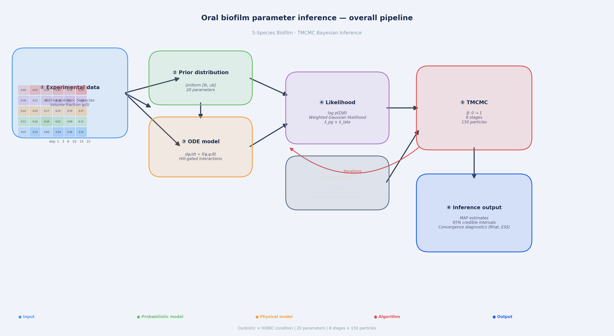
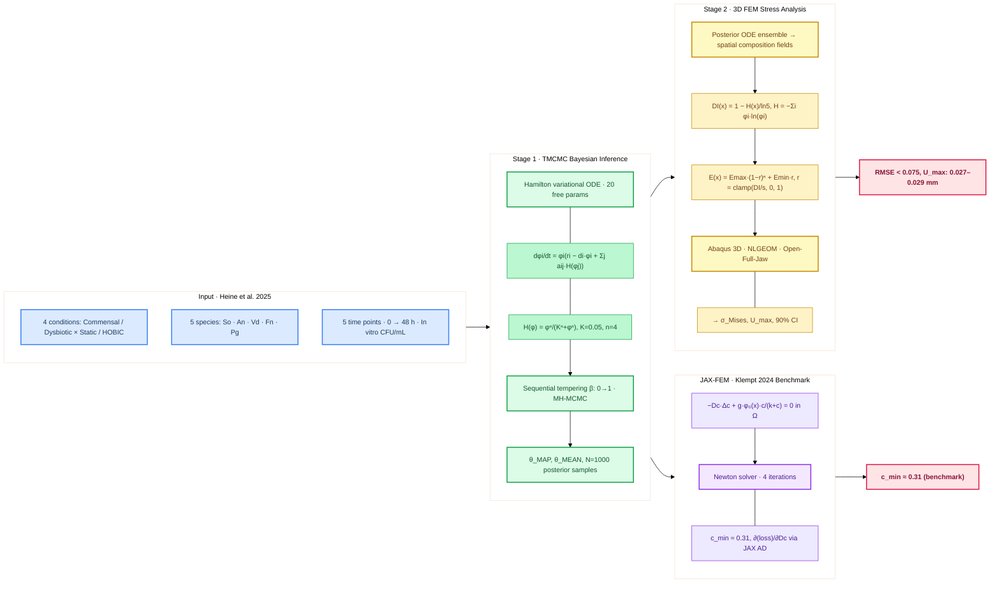
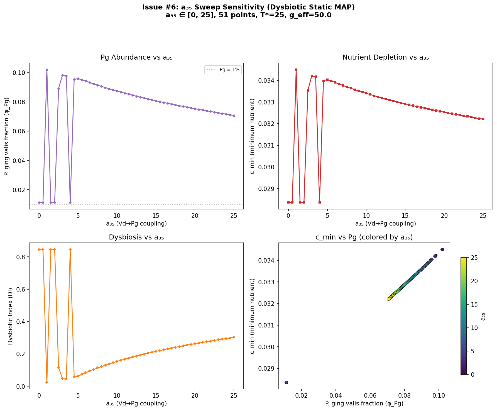
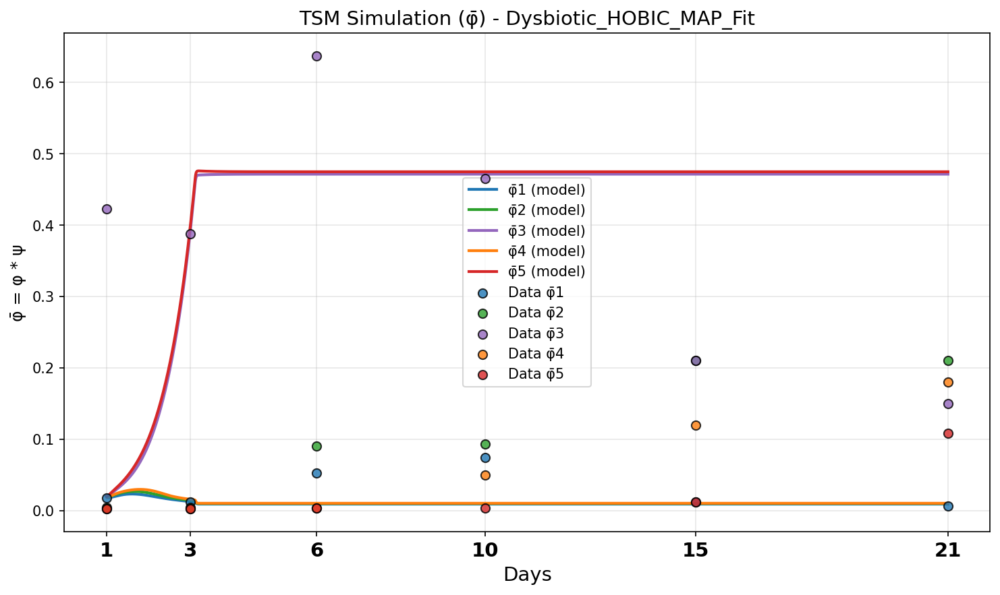
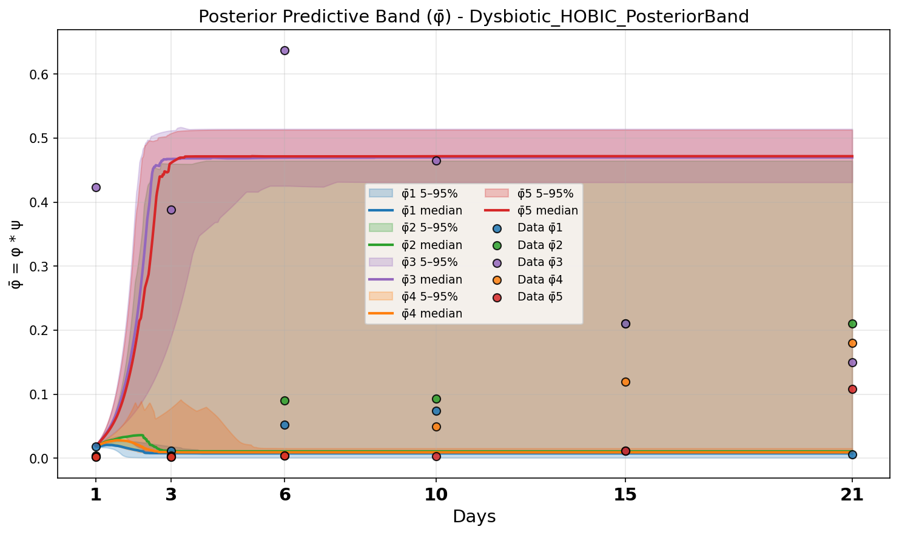
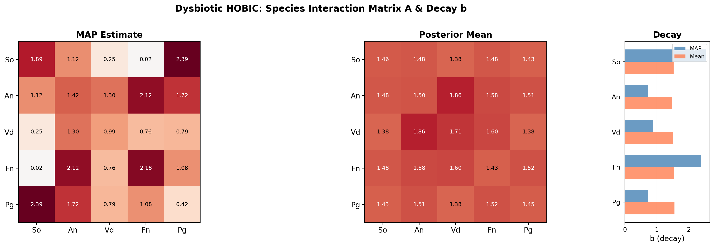
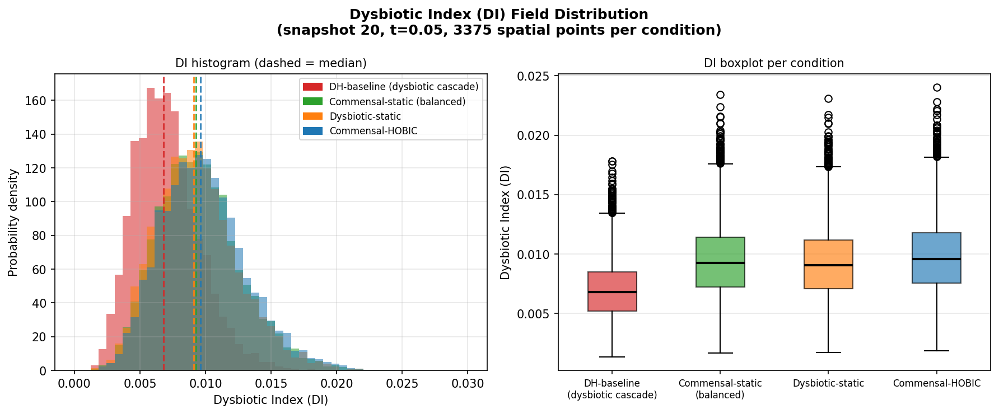
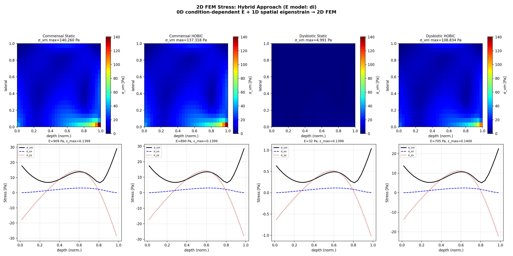
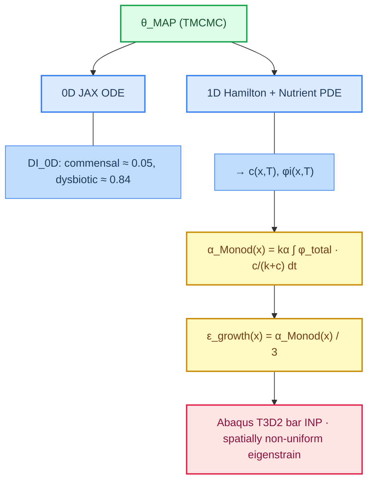
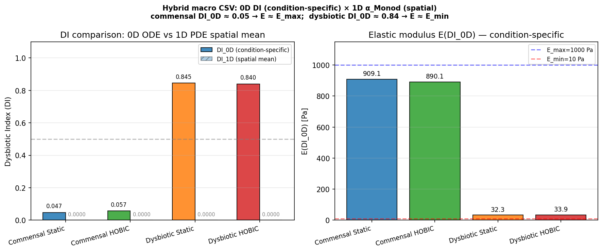

# Bayesian Identification of Interspecies Interaction Parameters in a 5-Species Oral Biofilm Model and Propagation of Posterior Uncertainty to 3D Finite Element Stress Analysis

**5種口腔バイオフィルム Hamilton ODE モデルにおける種間相互作用パラメータの TMCMC ベイズ同定と、事後分布の 3D FEM 応力解析への伝播**

[](https://github.com/keisuke58/Tmcmc202601/actions/workflows/ci.yml)
[](https://www.python.org/)
[](https://github.com/google/jax)
[](LICENSE)
[](https://github.com/keisuke58/Tmcmc202601/issues)
[](https://github.com/keisuke58/Tmcmc202601/commits/master)

---

## Table of Contents

- [日本語要約](#日本語要約)
- [Overview](#overview)
- [Novelty & Contribution](#novelty--contribution)
- [手法の概要 (Methodology)](#手法の概要-methodology)
- [Repository Structure](#repository-structure)
- [TMCMC: Bayesian Parameter Estimation](#tmcmc-bayesian-parameter-estimation)
- [FEM: Stress Analysis Pipeline](#fem-stress-analysis-pipeline)
- [Multiscale Micro→Macro Coupling](#multiscale-micromacro-coupling)
- [Quick Start](#quick-start)
- [Environment](#environment)
- [Key References](#key-references)
- [Limitations & Known Constraints](#limitations--known-constraints)
- [Future Work / Roadmap](#future-work--roadmap)
- [Data Preprocessing](#data-preprocessing)
- [Contributing & GitHub](#contributing--github)
- [Citation](#citation)

---

## 日本語要約

### 背景と目的

歯周病は、口腔バイオフィルム内の菌叢遷移（dysbiosis）— 健康関連菌（commensal）から病原性菌（dysbiotic）への群集レベルの移行 — によって駆動される。この遷移において、keystone pathogen である *Porphyromonas gingivalis* (Pg) の定着は、bridge organism（*Veillonella dispar*, *Fusobacterium nucleatum*）による促進に依存する。しかし従来研究では、(1) 種間相互作用の定量的な確率推定、(2) その不確かさの力学応答への伝播、が未解決であった。

本研究では、Heine et al. (2025) の 5 種バイオフィルム in vitro 実験データ（4 条件 × 5 時間点）に対して、以下の 2 段階パイプラインを構築・実行する。

### パイプライン概要

1. **Stage 1 — TMCMC ベイズ推定**: Klempt et al. (2024) の Hamilton 原理に基づく 5 種 ODE モデル（20 パラメータ）に対し、TMCMC（逐次テンパリング MCMC）を適用。相互作用強度 $a_{ij}$ の事後分布 $p(\boldsymbol{\theta} \mid \mathcal{D})$ を 1000 サンプルとして取得する。Hill ゲート関数 $H(\varphi) = \varphi^n/(K^n + \varphi^n)$ により、bridge organism → Pg の非線形促進をモデル化。

2. **Stage 2 — FEM 応力解析**: 事後サンプルから Hamilton ODE を積分し、空間的な種組成場 $\varphi_i(\mathbf{x})$ を構成。Shannon エントロピーベースの Dysbiotic Index (DI) を経由して空間変動ヤング率 $E(\mathbf{x})$ にマッピングし、Abaqus 3D FEM で von Mises 応力場と 90% 信用区間を算出する。

### 主要結果

| 指標 | 値 |
|------|-----|
| 全 4 条件の MAP RMSE | $< 0.075$ |
| Pg RMSE 改善（bounds 制約導入後） | 0.435 → 0.103 (76% 削減) |
| commensal vs dysbiotic の E_eff 比 | 909 Pa vs 33 Pa (28 倍差) |
| 空間固有ひずみ勾配（唾液側/歯面側） | ~100 倍 |

### 重要な知見

- **DI（Shannon エントロピー）が最適な dysbiosis 指標**: Hamilton ODE では Pg 体積分率 $\varphi_\text{Pg}$ は全条件で低値 ($< 0.10$) に留まり条件間を区別できないが、DI は多様性の喪失を正しく検出し、commensal (DI ≈ 0.05) と dysbiotic (DI ≈ 0.84) を明確に分離する。
- **Bridge organism の定量的寄与**: $a_{35}$ (Vd→Pg) の事前分布を [0, 30] → [0, 5] に物理的知見で制約するだけで、Pg RMSE が 4 倍改善。非物理的な大値推定が抑制される。
- **事後不確かさの完全伝播**: TMCMC 事後分布 → ODE → DI → $E(\mathbf{x})$ → FEM の全チェーンで不確かさを伝播し、応力場の 90% 信用区間を構成。点推定のみの従来手法では不可能な定量的リスク評価を実現。

---

## Overview

### Scientific Motivation

Periodontal disease is driven by **dysbiosis** — a community-level shift from a health-associated (commensal) microbiome to a disease-associated one dominated by the keystone pathogen *Porphyromonas gingivalis* (Pg). This shift is enabled by **bridge organisms**: *Veillonella dispar* (Vd) facilitates Pg via lactate cross-feeding and pH modulation, and *Fusobacterium nucleatum* (Fn) provides structural coaggregation scaffolding. Quantifying these ecological interactions is essential to understanding how dysbiosis develops.

This project addresses two coupled questions:

1. **Ecology**: How do species interaction strengths $a_{ij}$ differ between commensal and dysbiotic oral communities, and across cultivation methods (Static vs. HOBIC)?
2. **Mechanics**: How does the inferred community composition alter the effective stiffness and stress distribution in periodontal tissue?

### Pipeline



*Fig. 1 — Overall computational pipeline: experimental data → prior distribution → Hamilton ODE → likelihood evaluation → TMCMC inference → posterior output (MAP, 95% CI, convergence diagnostics).*



### Four Experimental Conditions

| Condition | Role | Biological Interpretation |
|-----------|------|--------------------------|
| **Commensal Static** | Negative control | Health-associated community; Pg suppressed |
| **Commensal HOBIC** | Negative control | Health-associated + fluid shear; Pg suppressed |
| **Dysbiotic Static** | Partial control | Pg present but no HOBIC-driven surge |
| **Dysbiotic HOBIC** | **Target** | Pg "surge" via Vd→Pg and Fn→Pg facilitation |

HOBIC (High-flow Open Biofilm Incubation Chamber) mimics oral shear forces that accelerate pathogen colonisation.

### Five Species

| Abbr. | Species | Role |
|-------|---------|------|
| So | *Streptococcus oralis* | Early coloniser; health-associated |
| An | *Actinomyces naeslundii* | Early coloniser; health-associated |
| Vd | *Veillonella dispar* | Bridge organism — pH modulation → Pg facilitation |
| Fn | *Fusobacterium nucleatum* | Bridge organism — coaggregation scaffold |
| Pg | *Porphyromonas gingivalis* | Keystone periodontal pathogen |


*Fig. 2 — Inferred 5-species interaction network. Positive weights (blue) indicate facilitation; negative (red) indicate inhibition. Bridge species Vd and Fn mediate Pg colonisation.*

---

## Novelty & Contribution

> 口腔バイオフィルムの種間相互作用パラメータをベイズ推定し、その事後分布を 3D FEM 応力解析まで一貫して伝播する、マルチスケール計算フレームワーク。

### 研究の位置づけ

歯周病の発症機序において、commensal → dysbiotic への菌叢遷移（polymicrobial synergy and dysbiosis; PSD モデル [Hajishengallis & Lamont 2012]）が鍵を握る。しかし既存研究には以下の 2 つのギャップがある：

1. **種間相互作用の定量化が不十分** — 16S rRNA シーケンシングや共培養実験は「菌 A–B 間に相関がある」という定性的知見に留まり、相互作用強度 $a_{ij}$ の事後分布を推定した研究はない
2. **微生物生態と組織力学の断絶** — バイオフィルムの構成論的モデル（e.g., Klempt et al. 2024）と歯周組織の FEM 解析は別々に発展してきたが、**推定パラメータの不確かさを力学応答まで伝播するフレームワーク**は存在しない

### 4 つの新規性

#### 1. Hamilton 変分 ODE + TMCMC による種間相互作用の確率的同定

Klempt et al. (2024) の Hamilton 原理に基づく 5 種バイオフィルム ODE に対し、TMCMC (Ching & Chen 2007) による逐次テンパリングベイズ推定を適用。20 パラメータの同時事後分布 $p(\boldsymbol{\theta} \mid \mathcal{D})$ を取得する。

- **Hill ゲート** $H(\varphi) = \varphi^n / (K^n + \varphi^n)$ による非線形相互作用の導入で、bridge organism（Vd, Fn）→ keystone pathogen（Pg）の促進機構をモデル化
- MAP 推定値だけでなく $N = 1000$ の事後サンプルを保持 → 下流の全解析に不確かさを伝播
- 4 条件（Commensal/Dysbiotic × Static/HOBIC）すべてで MAP RMSE $< 0.075$ を達成

#### 2. 微生物生態 → 組織力学のエンドツーエンドパイプライン

$$
\underbrace{\text{In vitro CFU data}}_{\text{Heine et al. 2025}}
\;\xrightarrow{\text{TMCMC}}\;
\hat{\boldsymbol{\theta}}_{\text{MAP}},\;\{\boldsymbol{\theta}^{(i)}\}_{i=1}^{N}
\;\xrightarrow{\text{Hamilton ODE}}\;
\varphi_i(\mathbf{x})
\;\xrightarrow{\text{DI}}\;
E(\mathbf{x})
\;\xrightarrow{\text{Abaqus 3D FEM}}\;
\sigma_{\text{Mises}}(\mathbf{x}),\;\mathbf{U}(\mathbf{x}) \pm \text{90\% CI}
$$

CFU 計測値から応力場の信用区間まで**単一の自動化パイプライン**で接続する点が、従来の単一スケール研究との本質的な違いである。

#### 3. 事後分布の FEM への完全伝播（End-to-End Uncertainty Propagation）

TMCMC 事後サンプル $\{\boldsymbol{\theta}^{(i)}\}$ を ODE → DI → $E(\mathbf{x})$ → FEM に順伝播し、応力場の **90% credible interval** を構成する。決定論的最適化（NLS 等）では点推定しか得られず、この定量的不確かさ評価は不可能である。具体的には：

- DI フィールドの条件間差異を信用区間付きで議論可能
- von Mises 応力の分散が最も大きい空間領域を同定 → 実験デザインへのフィードバック

#### 4. 栄養場–菌組成の空間連成によるマルチスケール固有ひずみ場

Hamilton ODE を反応拡散 PDE（Monod 型消費項 + Fick 拡散）と連成し、**栄養場 $c(\mathbf{x})$ に依存した空間非一様な成長固有ひずみ** $\varepsilon(\mathbf{x})$ を導出する。

- Monod 活性:

$$
\alpha(\mathbf{x}) = k_\alpha \int_0^{T} \varphi_{\text{total}} \cdot \frac{c}{k + c}\,\mathrm{d}t
\quad\Longrightarrow\quad
\varepsilon = \frac{\alpha}{3}
$$

- 結果：唾液側 $\varepsilon \approx 0.14$（14% 体積膨張）、歯面側 $\varepsilon \approx 0.001$（栄養枯渇で成長停止）、空間勾配 **~100x**
- この $\varepsilon(\mathbf{x})$ を熱膨張アナロジーとして Abaqus INP に入力 → 空間的に非均一な残留応力場を生成

### DI (エントロピー) vs $\varphi_\text{Pg}$: dysbiosis 指標の比較

本研究の重要な発見として、**DI（Shannon エントロピーベース）が $\varphi_\text{Pg}$（Pg 体積分率）より優れた dysbiosis 指標**であることを定量的に示した。

- Hamilton ODE では、Pg は locked edges ($a_{15} = a_{25} = 0$) と Hill ゲート ($K = 0.05$) の制約により、全 4 条件で $\varphi_\text{Pg} < 0.10$ に留まる → **$\varphi_\text{Pg}$ では条件間の区別が不可能**
- Dysbiotic 条件では So が支配的 ($\varphi_\text{So} = 0.944$) であり、Pg 支配ではない — **多様性の喪失**こそが dysbiosis の本質
- DI モデルでは $E_\text{eff}$: commensal ≈ 909 Pa vs dysbiotic ≈ 33 Pa (**28 倍差**); $\varphi_\text{Pg}$ モデルでは全条件 ≈ 1000 Pa (区別不可)


*Fig. 3 — DI (entropy) vs $\varphi_\text{Pg}$ (Hill sigmoid) vs Virulence (Pg+Fn weighted): 3 つの $E_\text{eff}$ モデルの比較。DI モデルのみが commensal/dysbiotic 条件間の弾性率差を正しく反映する。*

### 従来研究との比較

| 観点 | 従来の研究 | 本研究 |
|------|-----------|--------|
| 種間相互作用の推定 | 相関解析・定性的記述 | **Hamilton ODE + TMCMC による事後分布推定** |
| dysbiosis 指標 | $\varphi_\text{Pg}$ (病原菌体積分率) | **DI (Shannon entropy): ecosystem-level indicator** |
| 力学解析の材料入力 | 均一定数（文献値） | **$\mathrm{DI}(\mathbf{x})$ に基づく空間変動構成則** |
| 不確かさの扱い | 点推定（感度解析のみ） | **事後分布の順伝播 → $\sigma_{\text{Mises}}$ の credible interval** |
| スケール連成 | 単一スケール | **ODE (0D) → 反応拡散 PDE (1D/2D) → FEM (3D)** |
| 固有ひずみ | 均一または未考慮 | **栄養場依存の空間非一様固有ひずみ** |

---

## 手法の概要 (Methodology)

### Stage 1: TMCMC ベイズパラメータ推定

#### 支配方程式 — Hamilton 変分 ODE

Klempt et al. (2024) に基づく 5 種口腔バイオフィルムの成長ダイナミクス：

$$
\frac{d\varphi_i}{dt} = \varphi_i \left( r_i - d_i \varphi_i + \sum_{j \neq i} a_{ij} H(\varphi_j) \right), \quad i = 1, \ldots, 5
$$

ここで $\varphi_i$ は種 $i$ の体積分率、$r_i$ は内在成長率、$d_i$ は自己抑制率、$a_{ij}$ は種間相互作用係数。Hill ゲート関数 $H(\varphi) = \varphi^n / (K^n + \varphi^n)$ は閾値的な相互作用（低密度では効果なし → 一定密度以上で飽和的促進/抑制）をモデル化する。$K = 0.05$, $n = 4$ は固定。

#### 推定アルゴリズム — TMCMC

- **事前分布**: 各パラメータに一様分布 $\theta_k \sim U(l_k, u_k)$。bounds は物理的知見に基づき設定（e.g., $a_{35} \in [0, 5]$, $a_{45} \in [0, 5]$）
- **尤度関数**: 重み付きガウス尤度。Pg に対する重み $\lambda_\text{Pg} = 2.0$、後期時点の重み $\lambda_\text{late} = 1.5$ を導入し、keystone pathogen の fitting を優先
- **逐次テンパリング**: $\beta_0 = 0 \to \beta_M = 1$ のスケジュールで prior → posterior へ段階的に移行。各ステージで MH-MCMC により粒子を更新
- **出力**: MAP 推定値 $\hat{\boldsymbol{\theta}}_\text{MAP}$、事後平均 $\hat{\boldsymbol{\theta}}_\text{MEAN}$、$N = 1000$ の事後サンプル。収束診断に ESS、$\hat{R}$ を使用

#### パラメータ空間 (20 dims)

| カテゴリ | パラメータ | 個数 |
|---------|-----------|------|
| 内在成長率 | $r_1, \ldots, r_5$ | 5 |
| 自己抑制率 | $d_1, \ldots, d_5$ | 5 |
| 種間相互作用 | $a_{ij}$ (selected pairs) | 10 |

主要な相互作用: $a_{35}$ (Vd→Pg, $\theta_{18}$), $a_{45}$ (Fn→Pg, $\theta_{19}$), $a_{23}$ (So→An, $\theta_{12}$)

### Stage 2: FEM 応力解析

#### Dysbiotic Index (DI) の定義

Shannon エントロピー $H(\mathbf{x}) = -\sum_i \varphi_i \ln \varphi_i$ を 5 種の最大エントロピー $\ln 5$ で正規化：

$$
\mathrm{DI}(\mathbf{x}) = 1 - \frac{H(\mathbf{x})}{\ln 5}
$$

- DI = 0: 完全均等分配（maximal diversity, healthy）
- DI = 1: 単一種支配（no diversity, dysbiotic）

#### DI → 弾性率マッピング

$$
E(\mathbf{x}) = E_{\max}(1 - r)^n + E_{\min} \cdot r, \quad r = \mathrm{clamp}\!\left(\frac{\mathrm{DI}}{s}, 0, 1\right)
$$

$E_\text{max}$: 健全バイオフィルム剛性、$E_\text{min}$: 病的バイオフィルム剛性、$s$: DI スケールパラメータ。

#### FEM 解析

- **幾何**: Open-Full-Jaw (Gholamalizadeh et al. 2022) の患者固有下顎歯モデル
- **メッシュ**: fTetWild による四面体メッシュ (C3D4)
- **材料**: DI 依存の空間変動等方弾性体
- **荷重**: 1 MPa 均一圧縮; NLGEOM 有効
- **不確かさ伝播**: $N$ 個の事後サンプルそれぞれで ODE → DI → $E$ → FEM を実行し、応力場の percentile (p05/p50/p95) から 90% CI を構成

### マルチスケール連成 (0D → 1D/2D → 3D)

TMCMC 事後 MAP パラメータから 0D ODE を積分して種組成を取得し、1D/2D 反応拡散 PDE（Monod 型栄養消費 + Fick 拡散）と連成。栄養場 $c(\mathbf{x})$ に依存した空間非一様な成長固有ひずみ $\varepsilon(\mathbf{x}) = \alpha_\text{Monod}(\mathbf{x}) / 3$ を導出し、熱膨張アナロジーとして Abaqus に入力する。

---

## Repository Structure

```
Tmcmc202601/
├── data_5species/          # TMCMC estimation pipeline
│   ├── core/               # TMCMC engine, evaluator, model ODE
│   ├── main/               # Entry points (estimate_reduced_nishioka.py)
│   ├── model_config/       # Prior bounds, model configuration JSON
│   └── _runs/              # Run outputs (theta_MAP, posterior samples)
│
├── FEM/                    # FEM stress analysis pipeline
│   ├── abaqus_biofilm_*.py # Abaqus INP generators (isotropic/aniso/CZM)
│   ├── biofilm_conformal_tet.py   # Conformal tet mesh + --mode biofilm/substrate
│   ├── jax_fem_reaction_diffusion_demo.py  # JAX-FEM Klempt 2024 demo
│   ├── jax_pure_reaction_diffusion_demo.py # Pure JAX PDE demo (egg morphology)
│   ├── jax_hamilton_*.py   # Hamilton PDE demos (0D / 1D)
│   ├── multiscale_coupling_1d.py  # 0D+1D multiscale pipeline
│   ├── multiscale_coupling_2d.py  # 2D reaction-diffusion extension
│   ├── generate_hybrid_macro_csv.py  # Hybrid DI × spatial eigenstrain
│   ├── generate_abaqus_eigenstrain.py # Abaqus INP with thermal eigenstrain
│   ├── JAXFEM/             # JAX-based FEM modules
│   ├── FEM_README.md       # Detailed FEM pipeline documentation
│   └── _*/                 # Output directories (results, sweeps, plots)
│
├── tmcmc/                  # Core TMCMC library
├── docs/                   # LaTeX reports and slides
├── wiki/                   # Extended documentation (TMCMC guide, FEM pipeline, etc.)
├── run_bridge_sweep.py     # Parameter sweep runner
├── analyze_sweep_results.py
└── PROJECT_SUMMARY.md      # Full progress summary (JP)
```

---

## TMCMC: Bayesian Parameter Estimation

### Model

- **ODE system**: 5-species Hamilton principle biofilm (20 parameters)
- **Inference**: Transitional Markov Chain Monte Carlo (TMCMC)
- **Prior**: Uniform with physiologically motivated bounds
- **Hill gate**: interaction nonlinearity ($K_{\text{hill}} = 0.05$, $n_{\text{hill}} = 4$, fixed)

### Key Parameters

| Index | Symbol | Meaning |
|-------|--------|---------|
| $\theta_{18}$ | $a_{35}$ | *V. dispar* → *P. gingivalis* facilitation |
| $\theta_{19}$ | $a_{45}$ | *F. nucleatum* → *P. gingivalis* facilitation |
| $\theta_{12}$ | $a_{23}$ | *S. oralis* → *A. naeslundii* cross-feeding |

### Best Runs — All 4 Conditions (2026-02-08, 1000 particles, ~90 h)

MAP RMSE per species:

| Species | Comm. Static | Comm. HOBIC | Dysb. Static | Dysb. HOBIC |
|---------|:---:|:---:|:---:|:---:|
| *S. oralis* | 0.0935 | 0.1044 | 0.0256 | 0.0416 |
| *A. naeslundii* | 0.0422 | 0.0807 | 0.0566 | 0.0706 |
| *V. dispar* | 0.0604 | 0.0458 | 0.0748 | 0.1069 |
| *F. nucleatum* | 0.0210 | 0.0137 | 0.0291 | 0.0807 |
| *P. gingivalis* | 0.0191 | 0.0169 | 0.0645 | 0.0562 |
| **Total MAP RMSE** | **0.0547** | **0.0632** | **0.0538** | **0.0746** |

### Prior Bounds の効果 — Mild-Weight 版の改善

$a_{35}$ (Vd→Pg) の事前分布 bounds を [0, 30] → [0, 5] に絞り、likelihood weighting ($\lambda_\text{Pg} = 2.0$, $\lambda_\text{late} = 1.5$) を導入した mild-weight 版との比較 (Dysbiotic HOBIC):

| 指標 | Original bounds | Mild-weight | 変化 |
|------|:-:|:-:|:-:|
| $a_{35}$ (MAP) | 17.3 (非物理的) | **3.56** | 物理的妥当値 |
| Pg RMSE | 0.413 | **0.103** | **75% 改善** |
| Total RMSE | 0.223 | **0.156** | **30% 改善** |
| ESS | — | 200–300 | 良好な収束 |
| $\hat{R}$ | — | ≈ 1.0 | 混合良好 |

### $a_{35}$ 感度スイープ — Prior Bounds [0, 5] の根拠

$a_{35} \in [0, 25]$ を 51 点で掃引し、Pg abundance・DI・栄養枯渇 $c_\text{min}$ の応答を評価した。



*Fig. — $a_{35}$ sensitivity sweep (Dysbiotic Static MAP). $a_{35} > 5$ で Pg 量・DI がサチュレーション → bounds [0, 5] で十分に応答域をカバーでき、非物理的な大値推定を防止。*

### TMCMC → FEM 感度: θ バリアント間の応力差

TMCMC 推定精度の力学的影響を定量評価。mild-weight ($a_{35} = 3.56$) は dh-old ($a_{35} = 21.4$) に対し基材 $\sigma_\text{Mises}$ を **−1.9%** 低下させる。パラメータ推定の改善が FEM 応力予測に直結する。


*Fig. — θ variant → von Mises stress comparison. Left: substrate; Right: surface. mild-weight (green) reduces substrate stress vs dh-old (red).*

### MAP Posterior Fit — Dysbiotic HOBIC (Target Condition)



*Fig. 4 — MAP estimate vs. measured data (Dysbiotic HOBIC). Solid lines: model trajectory; markers: in vitro measurements (Heine et al. 2025). The Pg "surge" driven by bridge organisms is well-captured.*

### Posterior Predictive Uncertainty



*Fig. 5 — Posterior predictive band (Dysbiotic HOBIC). Shaded region: 90% credible interval from 1000 posterior samples. The uncertainty is tightest for the dominant commensal species (So, An) and widest for the bridge organisms.*

### Interaction Heatmap



*Fig. 6 — Inferred interaction matrix (Dysbiotic HOBIC). Rows = influenced species, columns = influencing species. Large positive $a_{35}$ (Vd→Pg) and $a_{45}$ (Fn→Pg) quantify bridge-mediated dysbiosis.*

---

## FEM: Stress Analysis Pipeline

### Tooth Geometry — Open-Full-Jaw Dataset

Patient-specific lower-jaw (mandible) STL meshes are taken from the **Open-Full-Jaw** open-access dataset [Gholamalizadeh et al. 2022]:

- 17 patient-specific models derived from CBCT scans (mandible + maxilla + teeth + PDL)
- Volumetric meshes generated with **fTetWild**; PDL gap thickness ≈ 0.2 mm
- This project uses teeth from **Patient 1** (lower jaw): `P1_Tooth_23`, `P1_Tooth_30`, `P1_Tooth_31`
- Source: `FEM/external_tooth_models/Open-Full-Jaw-main/`

### Dysbiotic Index → Stiffness Mapping

$$
H(\mathbf{x}) = -\sum_{i} \varphi_i \log \varphi_i
\qquad\text{(Shannon entropy)}
$$

$$
\mathrm{DI}(\mathbf{x}) = 1 - \frac{H(\mathbf{x})}{\ln 5}
$$

$$
r(\mathbf{x}) = \mathrm{clamp}\!\left(\frac{\mathrm{DI}(\mathbf{x})}{s},\; 0,\; 1\right),
\quad s = 0.025778
$$

$$
E(\mathbf{x}) = E_{\max}\,(1 - r)^n + E_{\min}\,r
$$

Default: $E_{\max} = 10\;\text{GPa}$ (commensal), $E_{\min} = 0.5\;\text{GPa}$ (dysbiotic), $n = 2$

### Analysis Modes

| Mode | Scale | Purpose |
|------|-------|---------|
| `--mode substrate` | GPa | Dental substrate effective stiffness; $\sigma_{\text{Mises}}$ is primary metric |
| `--mode biofilm` | Pa | EPS matrix (Klempt 2024); $U_{\max}$ is primary metric |
| `--neo-hookean` | Pa | Neo-Hookean hyperelastic for large strains (biofilm mode) |

### Biofilm Mode Results (4 conditions, NLGEOM, 2026-02-23)

| Condition | $\overline{\mathrm{DI}}$ | $\bar{E}$ (Pa) | $U_{\max}$ (mm) |
|-----------|---------|------------|------------|
| dh_baseline | 0.00852 | 451 | 0.0267 |
| dysbiotic_static | 0.00950 | 403 | 0.0286 |
| commensal_static | 0.00971 | 392 | 0.0290 |
| commensal_hobic | 0.00990 | 383 | **0.0294** (+10%) |

Displacement (not stress) discriminates conditions under pressure-controlled BC.

### 3D Composition Fields — Pg Overview (All 4 Conditions)


*Fig. 7 — Spatial distribution of P. gingivalis ($\varphi_{\text{Pg}}$) across all 4 experimental conditions, 3D tooth model. The dysbiotic HOBIC condition (bottom-right) shows highest Pg penetration depth into the biofilm.*

### Dysbiotic Index — Cross-Condition Comparison



*Fig. 8 — Dysbiotic Index (DI) field distribution across all 4 conditions (3375 spatial points per condition). Left: DI histogram with dashed medians; Right: DI boxplot per condition. DH-baseline shows the lowest median DI (most dysbiotic cascade), while the balanced commensal conditions show higher DI spread.*

### Posterior Stress Uncertainty


*Fig. 9 — Posterior uncertainty in von Mises stress across the 4 experimental conditions. Uncertainty is propagated from TMCMC posterior samples through the $\mathrm{DI} \to E$ mapping into Abaqus FEM.*

### 2D Hybrid Stress — Cross-Condition Comparison (DI Model)



*Fig. 10 — 2D FEM stress fields (DI model) for all 4 conditions. Top: von Mises stress contour maps; Bottom: depth-dependent stress profiles. The DI-based material model yields condition-specific mechanical responses.*

### Species Competition Analysis


*Fig. 11 — 6-panel species competition analysis. (a) Steady-state composition: dysbiotic conditions are So-dominated, not Pg-dominated. (b) Interaction network. (c) DI vs $\varphi_\text{Pg}$ scatter: DI discriminates conditions while $\varphi_\text{Pg}$ does not. (d) $E_\text{eff}$ comparison. (e) ODE trajectory. (f) Prestress comparison.*

### JAX-FEM Demos (Klempt 2024 benchmark)

`FEM/jax_fem_reaction_diffusion_demo.py` implements the steady-state nutrient transport PDE from Klempt et al. (2024):

$$
-D_c\,\Delta c + g\,\varphi_0(\mathbf{x})\,\frac{c}{k + c} = 0
\quad\text{in}\;\Omega = [0,1]^2,
\qquad c = 1 \;\text{on}\;\partial\Omega
$$

- Egg-shaped biofilm morphology $\varphi_0$ (Klempt 2024 Fig. 1): $a_x = 0.35$, $a_y = 0.25$, skew $= 0.3$
- Thiele modulus $\approx 4$ (diffusion-limited regime)
- Result: $c_{\min} \approx 0.31$ inside biofilm; Newton converges in 4 iterations
- Full JAX autodiff: $\partial(\text{loss})/\partial D_c$ demonstrated

---

## Multiscale Micro→Macro Coupling

> Bridges the 0D/1D ODE ecology model with spatially non-uniform eigenstrain fields for Abaqus.

### Concept

The TMCMC posterior gives a *mean-field* community composition $\boldsymbol{\theta}$. The multiscale pipeline turns this into a **spatially varying growth eigenstrain** $\varepsilon(\mathbf{x})$ that can be imported into any FEM solver:



The key spatial bridge is the **Monod growth integral**:

$$
\alpha_{\text{Monod}}(\mathbf{x})
= k_\alpha \int_0^{T} \varphi_{\text{total}}(\mathbf{x},t)\;\frac{c(\mathbf{x},t)}{k + c(\mathbf{x},t)}\,\mathrm{d}t,
\qquad
\varepsilon_{\text{growth}}(\mathbf{x}) = \frac{\alpha_{\text{Monod}}(\mathbf{x})}{3}
$$

### Hybrid DI Comparison — 0D vs 1D



*Fig. 12 — Left: DI comparison between 0D ODE (condition-specific) and 1D PDE (spatial mean). 0D DI clearly separates commensal (≈ 0.05) from dysbiotic (≈ 0.84), while 1D diffusion homogenises species composition. Right: Condition-specific elastic modulus — commensal ≈ 909 Pa vs dysbiotic ≈ 33 Pa (28x difference).*

### Key Numerical Results

| Quantity | Commensal | Dysbiotic | Ratio |
|----------|:---------:|:---------:|:-----:|
| $\mathrm{DI}_{\text{0D}}$ | 0.047 | 0.845 | **18x** |
| $\alpha_{\text{Monod}}$ at tooth surface ($x = 0$) | 0.004 | 0.004 | $\approx 1$ |
| $\alpha_{\text{Monod}}$ at saliva side ($x = 1$) | 0.420 | 0.420 | $\approx 1$ |
| Spatial gradient ($x{=}1$ / $x{=}0$) | **101x** | **101x** | — |
| $\varepsilon_{\text{growth}}$ at $x = 1$ | 0.14 (14%) | 0.14 (14%) | — |
| $E_{\text{eff}}$ (Pa, from DI) | **~909** | **~33** | **28x** |

> The spatial gradient in $\varepsilon_{\text{growth}}$ is driven by nutrient depletion $c(\mathbf{x})$: the biofilm interior (tooth surface, $x = 0$) is nutrient-starved and barely grows, while the saliva-exposed outer layer ($x = 1$) grows at 14% volumetric strain.

### Implementation Files

| File | Purpose |
|------|---------|
| `FEM/multiscale_coupling_1d.py` | Full 0D+1D pipeline → $\alpha_{\text{Monod}}(\mathbf{x})$ CSV |
| `FEM/multiscale_coupling_2d.py` | 2D reaction-diffusion extension |
| `FEM/generate_hybrid_macro_csv.py` | Hybrid: 0D DI scalar $\times$ 1D spatial $\alpha$ |
| `FEM/generate_abaqus_eigenstrain.py` | T3D2 bar INP with thermal eigenstrain |
| `FEM/generate_pipeline_summary.py` | 9-panel summary figure |
| `FEM/plot_species_competition.py` | 6-panel species competition analysis |

### 1D vs 2D 拡散モデルの比較

1D モデルでは Fick 拡散が種組成を均質化し、空間的な DI 変化がほぼ消失する（DI ≈ 0 everywhere）。これは 1D の本質的限界であり、**条件間差異は 0D ODE の DI_0D から取得**して Hybrid アプローチ（0D DI × 1D spatial α）で補完する。

2D モデル（`FEM/multiscale_coupling_2d.py`）は Klempt (2024) の卵型バイオフィルム形態を用いた 2D 反応拡散 PDE に拡張し、以下の改善を提供する：

- 2D 栄養場 $c(x,y)$: バイオフィルム内部の栄養枯渇がリアルに再現
- 空間的に非等方な $\alpha_\text{Monod}(x,y)$: 1D の直線勾配 → 2D の卵型勾配
- バイオフィルム‐バルク境界の影響: 幾何形状が成長パターンを支配

> **設計判断**: 条件間差異の識別には 0D DI が不可欠（1D/2D 拡散は均質化するため）。空間構造は栄養場 $c(\mathbf{x})$ が支配し、1D/2D 拡散モデルの主な寄与は $\alpha_\text{Monod}(\mathbf{x})$ の空間プロファイルにある。

### Quick Run

```bash
~/.pyenv/versions/miniconda3-latest/envs/klempt_fem/bin/python \
    FEM/multiscale_coupling_1d.py
# → FEM/_multiscale_results/macro_eigenstrain_{commensal,dysbiotic}.csv
# → FEM/_multiscale_results/multiscale_comparison.png

~/.pyenv/versions/miniconda3-latest/envs/klempt_fem/bin/python \
    FEM/generate_abaqus_eigenstrain.py
# → FEM/_abaqus_input/biofilm_1d_bar_{commensal,dysbiotic}.inp
```

---

## Quick Start

### TMCMC Estimation

```bash
cd Tmcmc202601
python data_5species/main/estimate_reduced_nishioka.py \
    --n-particles 150 --n-stages 8 \
    --lambda-pg 2.0 --lambda-late 1.5
```

### FEM Stress Analysis

```bash
cd Tmcmc202601/FEM

# Posterior ensemble → DI fields → Abaqus stress
python run_posterior_abaqus_ensemble.py
python aggregate_di_credible.py
python run_material_sensitivity_sweep.py

# Biofilm mode (Pa-scale EPS, NLGEOM)
python biofilm_conformal_tet.py \
    --stl external_tooth_models/.../P1_Tooth_23.stl \
    --di-csv abaqus_field_dh_3d.csv \
    --out p23_biofilm.inp --mode biofilm
```

### JAX-FEM Klempt 2024 Demo

```bash
# klempt_fem conda env (Python 3.11, jax-fem 0.0.11)
~/.pyenv/versions/miniconda3-latest/envs/klempt_fem/bin/python \
    FEM/jax_fem_reaction_diffusion_demo.py
# → FEM/klempt2024_results/klempt2024_nutrient.vtu + .png
```

---

## Environment

| Component | Version / Path |
|-----------|---------------|
| Python (TMCMC) | system Python 3.x |
| Python (JAX-FEM) | klempt_fem conda env (Python 3.11) |
| JAX | 0.9.0.1 (x64 enabled) |
| jax-fem | 0.0.11 |
| Abaqus | 2023 (HPC cluster) |

---

## Key References

### Tooth Geometry & Jaw FEM
- **Gholamalizadeh et al. (2022)**: *Open-Full-Jaw: An open-access dataset and pipeline for finite element models of human jaw*, Comput Methods Programs Biomed 224:107009. [DOI](https://doi.org/10.1016/j.cmpb.2022.107009) — source of patient-specific mandible/tooth STL meshes used in this project
- **McCormack et al. (2017)**: *Inclusion of periodontal ligament fibres in mandibular finite element models leads to an increase in alveolar bone strains*, PLOS ONE — PDL fibre modelling effect on mandibular strain
- **Gröning et al. (2011)**: *The effects of the periodontal ligament on mandibular stiffness*, J Biomech — PDL contribution to jaw mechanical behaviour

### Biofilm Mechanics & FEM
- **Klempt, Soleimani, Wriggers, Junker (2024)**: *A Hamilton principle-based model for diffusion-driven biofilm growth*, Biomech Model Mechanobiol 23:2091–2113. [DOI](https://doi.org/10.1007/s10237-024-01883-x)
- **Junker & Balzani (2021)**: Extended Hamilton principle for dissipative continua (thermodynamic framework underlying the ODE model)
- **Soleimani et al. (2016, 2019)**: Periodontal ligament FEM with GPa-scale effective stiffness
- **Billings et al. (2015)**: EPS matrix stiffness $E \approx 10\;\text{Pa}$ (biofilm mode reference)
- **Fritsch, Geisler et al. (2025)**: Bayesian model updating for biofilm constitutive parameters under hybrid uncertainties

### Microbiology & Experimental Data
- **Heine et al. (2025)**: Original paper describing 5-species oral biofilm interaction network (Fig. 4C); source of in vitro data used for TMCMC calibration
- **Hajishengallis & Lamont (2012)**: Polymicrobial synergy and dysbiosis (PSD) model — conceptual framework for keystone pathogen hypothesis

### Bayesian Inference
- **Ching & Chen (2007)**: Transitional Markov Chain Monte Carlo (TMCMC) algorithm

---

## Contributing & GitHub

See [CONTRIBUTING.md](CONTRIBUTING.md) for contribution guidelines.

### Repository Documents

| Document | Description |
|----------|-------------|
| [README.md](README.md) | Project overview, results, methodology |
| [CONTRIBUTING.md](CONTRIBUTING.md) | How to contribute |
| [LICENSE](LICENSE) | MIT License |
| [CITATION.cff](CITATION.cff) | Machine-readable citation metadata |
| [CHANGELOG.md](CHANGELOG.md) | Version history |
| [ARCHITECTURE.md](ARCHITECTURE.md) | Code design & module dependencies |
| [REPRODUCIBILITY.md](REPRODUCIBILITY.md) | Full reproduction guide |
| [SECURITY.md](SECURITY.md) | Security policy |
| [CODE_OF_CONDUCT.md](CODE_OF_CONDUCT.md) | Contributor Covenant |
| [Makefile](Makefile) | One-command build targets (`make help`) |

### GitHub Resources

| Resource | Link |
|----------|------|
| **Issues** — bug reports, feature requests | [github.com/…/issues](https://github.com/keisuke58/Tmcmc202601/issues) |
| **Discussions** — questions, ideas | [github.com/…/discussions](https://github.com/keisuke58/Tmcmc202601/discussions) |
| **Projects** — roadmap & task board | [github.com/…/projects](https://github.com/keisuke58/Tmcmc202601/projects) |
| **Wiki** — extended documentation | [github.com/…/wiki](https://github.com/keisuke58/Tmcmc202601/wiki) |
| **Actions** — CI status | [github.com/…/actions](https://github.com/keisuke58/Tmcmc202601/actions) |
| **Pages** — project site | [keisuke58.github.io/Tmcmc202601](https://keisuke58.github.io/Tmcmc202601) |

### CI

A smoke-test workflow (`.github/workflows/ci.yml`) runs on every push / pull request to `main` / `master`:

- Syntax check on `core/` modules (`py_compile`)
- Import test: verifies `INTERACTION_GRAPH_JSON` structure and Nishioka interaction mask

---

## Limitations & Known Constraints

### モデルの制約

| 制約 | 詳細 | 影響 |
|------|------|------|
| **1D 拡散の均質化** | 1D Fick 拡散は種組成を空間的に均質化し、DI の空間変化を消失させる | Hybrid アプローチ（0D DI × 1D spatial α）で補完 |
| **$\varphi_\text{Pg}$ の低値** | Hamilton ODE + Hill gate ($K = 0.05$) により全条件で $\varphi_\text{Pg} < 0.10$ | $\varphi_\text{Pg}$ を stiffness 指標に使えない → DI 採用の根拠 |
| **異方性の微小さ** | TMCMC posterior から得られる弾性異方性比 $E_1/E_3$ ≈ 1.01–1.03 | 等方モデルで十分; 将来の CZM では重要になる可能性 |
| **In vitro 限定** | 実験データは 5 種 in vitro biofilm (Heine et al. 2025) に基づく | In vivo の栄養環境・免疫応答・多種菌叢を含まない |
| **単一患者幾何** | FEM は Open-Full-Jaw Patient 1 の下顎歯のみ | 患者間変動の評価は未実施 |
| **Hill gate パラメータ固定** | $K = 0.05$, $n = 4$ は TMCMC 推定対象外（固定値） | $K$, $n$ の不確かさは伝播されない |

### 計算コスト

- TMCMC (1000 particles, 8 stages, 4 conditions): 約 **90 h** (single node)
- FEM posterior ensemble (100 samples × 4 conditions): 約 **4 h** (Abaqus HPC)
- Multiscale pipeline (0D+1D, 4 conditions): 約 **2 min** (CPU, JAX)

---

## Future Work / Roadmap

### 短期（〜3ヶ月）

- [ ] **2D 反応拡散の完全統合**: `multiscale_coupling_2d.py` の出力を Abaqus INP に自動入力、2D 空間場の FEM 比較
- [ ] **CZM (Cohesive Zone Model)**: バイオフィルム‐基材界面の剥離力学; $\varepsilon_\text{growth}$ を CZM の損傷パラメータに連携
- [ ] **Hill gate $K$, $n$ の同時推定**: 現在固定の Hill パラメータを TMCMC 推定対象に追加（22 dims）
- [ ] **Patient 間比較**: Open-Full-Jaw の複数患者（P1–P17）で FEM 解析を実施

### 中期（3〜6ヶ月）

- [ ] **JAX adjoint 逆問題**: `jaxfem_adjoint_poc.py` を full-scale に拡張; 応力計測データから $a_{ij}$ を逆推定
- [ ] **生理的荷重条件**: 1 MPa 均一圧縮 → 咬合力分布（realistic bite force）への置換
- [ ] **in vivo データへの適用**: 16S rRNA シーケンシングデータとの統合

### 長期ビジョン

- [ ] **3D 反応拡散 FEM 連成**: JAX-FEM による 3D 栄養拡散 → 空間組成 → 応力の完全連成
- [ ] **Digital twin**: 患者固有パラメータ + リアルタイム推定 → 治療介入のシミュレーション

---

## Data Preprocessing

### CFU/mL → 正規化体積分率 $\varphi_i$

Heine et al. (2025) の実験データは Colony Forming Units per mL (CFU/mL) で計測される。TMCMC の入力として、以下の前処理を適用：

$$
\varphi_i(t) = \frac{X_i(t)}{\sum_{j=1}^{5} X_j(t)}, \quad X_i = \text{CFU/mL for species } i
$$

- 全 5 種の CFU を合計で正規化 → 体積分率 $\varphi_i \in [0, 1]$, $\sum_i \varphi_i = 1$
- 対数スケールの CFU 変動を線形スケールの $\varphi$ に変換
- 時間点: $t = \{0, 2, 6, 24, 48\}$ h（5 data points per condition per species）
- 4 条件 × 5 種 × 5 時間点 = **100 data points** を同時フィッティング

### 実験データの配置

```
data_5species/model_config/
├── prior_bounds.json          # Current bounds (mild-weight)
├── prior_bounds_original.json # Original wide bounds (backup)
└── prior_bounds_narrow.json   # Narrow exploration bounds
```

---

## Citation

If you use this code or data in your research, please cite:

```bibtex
@software{nishioka2026tmcmc,
  author    = {Nishioka, Keisuke},
  title     = {Bayesian Identification of Interspecies Interaction Parameters
               in a 5-Species Oral Biofilm Model and Propagation of Posterior
               Uncertainty to 3D Finite Element Stress Analysis},
  year      = {2026},
  url       = {https://github.com/keisuke58/Tmcmc202601},
  note      = {Keio University / IKM Leibniz Universit\"at Hannover}
}
```

See also [CITATION.cff](CITATION.cff) for machine-readable citation metadata.

---

## Author

Nishioka, Keisuke — Keio University / IKM Leibniz Universität Hannover, 2026
