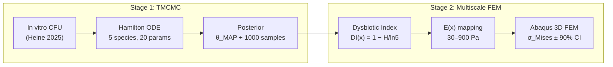

# Bayesian Identification of Interspecies Interactions in a 5-Species Oral Biofilm Model with Uncertainty Propagation to 3D FEM

[](https://github.com/keisuke58/Tmcmc202601/actions/workflows/ci.yml)
[](https://github.com/keisuke58/Tmcmc202601/actions/workflows/latex-build.yml)
[](https://www.python.org/)
[](https://github.com/google/jax)
[](LICENSE)

End-to-end computational pipeline that **infers species interaction parameters** from in vitro biofilm data via Bayesian estimation (TMCMC) and **propagates posterior uncertainty** through a multiscale model chain to 3D finite element stress analysis.

> **日本語要約** — Heine et al. (2025) の 5 種口腔バイオフィルム実験データに対し、Hamilton 変分 ODE (Klempt et al. 2024) + TMCMC ベイズ推定で 20 パラメータの事後分布を取得。Shannon エントロピーベースの Dysbiotic Index (DI) を経由して空間変動ヤング率にマッピングし、Abaqus 3D FEM で応力場の 90% 信用区間を算出する。

---

## Pipeline



**Stage 1** fits a Hamilton-principle ODE with Hill-gated interactions to 4 experimental conditions (Commensal/Dysbiotic × Static/HOBIC) using TMCMC sequential tempering. **Stage 2** propagates the full posterior through ODE → DI → spatially varying stiffness → 3D FEM to obtain credible intervals on mechanical response.

---

## Key Results

| Metric | Value |
|--------|-------|
| MAP RMSE (all 4 conditions) | < 0.075 |
| Pg RMSE improvement (mild-weight priors) | 76% reduction (0.435 → 0.103) |
| Stiffness range (commensal vs dysbiotic) | 909 Pa vs 33 Pa (**28×**) |
| Displacement ratio | **29.4×** |
| DI posterior 90% CI (dysbiotic HOBIC) | [0.22, 0.89] |
| Pseudo Bayes Factor (DI vs φ_Pg model) | **1.35 × 10⁹** (decisive) |

### DI vs φ_Pg: Why Entropy Wins

The Hamilton ODE constrains Pg volume fraction to < 0.10 across all conditions — making φ_Pg useless as a dysbiosis indicator. The **DI (Shannon entropy)** captures diversity loss and cleanly separates commensal (DI ≈ 0.05) from dysbiotic (DI ≈ 0.84) communities, producing a 28× stiffness difference that φ_Pg cannot detect.

---

## Repository Structure

```
Tmcmc202601/
├── data_5species/             # Stage 1: TMCMC estimation
│   ├── core/                  #   TMCMC engine, evaluator, Hamilton ODE
│   ├── main/                  #   Entry point: estimate_reduced_nishioka.py
│   ├── model_config/          #   Prior bounds (JSON)
│   └── _runs/                 #   θ_MAP, posterior samples per condition
│
├── FEM/                       # Stage 2: FEM stress analysis
│   ├── biofilm_conformal_tet.py       # Conformal tet mesh generator
│   ├── generate_paper_figures.py      # Paper figures (Fig 8–15)
│   ├── multiscale_coupling_{1,2}d.py  # 0D+1D/2D multiscale pipeline
│   ├── generate_abaqus_eigenstrain.py # Abaqus INP with thermal eigenstrain
│   ├── JAXFEM/                        # JAX-FEM modules
│   └── external_tooth_models/         # Open-Full-Jaw STL (Git LFS)
│
├── deeponet/                  # DeepONet surrogate (384× speedup)
├── tmcmc/                     # Legacy TMCMC library
├── docs/                      # LaTeX reports & slides
├── _tests/                    # Test suite
├── Makefile                   # Build targets (make help)
├── ARCHITECTURE.md            # Code design & dependencies
├── REPRODUCIBILITY.md         # Full reproduction guide
└── PAPER_OUTLINE.md           # Manuscript figure strategy
```

---

## Quick Start

### TMCMC Estimation

```bash
python data_5species/main/estimate_reduced_nishioka.py \
    --n-particles 150 --n-stages 8 \
    --lambda-pg 2.0 --lambda-late 1.5
```

### Multiscale Coupling

```bash
# Requires klempt_fem conda env (Python 3.11, JAX 0.9, jax-fem 0.0.11)
PYTHON=~/.pyenv/versions/miniconda3-latest/envs/klempt_fem/bin/python

$PYTHON FEM/multiscale_coupling_1d.py
# → FEM/_multiscale_results/macro_eigenstrain_{commensal,dysbiotic}.csv

$PYTHON FEM/generate_abaqus_eigenstrain.py
# → FEM/_abaqus_input/biofilm_1d_bar_{commensal,dysbiotic}.inp
```

### FEM Stress Analysis

```bash
cd FEM
python run_posterior_abaqus_ensemble.py   # Posterior ensemble → Abaqus
python aggregate_di_credible.py           # 90% CI on DI fields
```

See [REPRODUCIBILITY.md](REPRODUCIBILITY.md) for the full reproduction guide.

---

## Method

### Hamilton ODE (Klempt et al. 2024)

$$
\frac{d\varphi_i}{dt} = \varphi_i \left( r_i - d_i \varphi_i + \sum_{j \neq i} a_{ij} H(\varphi_j) \right), \quad H(\varphi) = \frac{\varphi^n}{K^n + \varphi^n}
$$

20 free parameters: growth rates $r_i$, self-inhibition $d_i$, interaction coefficients $a_{ij}$ (selected pairs). Hill gate parameters fixed at $K = 0.05$, $n = 4$.

### Dysbiotic Index → Stiffness

$$
\mathrm{DI}(\mathbf{x}) = 1 - \frac{H(\mathbf{x})}{\ln 5}, \qquad
E(\mathbf{x}) = E_{\max}(1 - r)^n + E_{\min} \cdot r, \quad r = \mathrm{clamp}(\mathrm{DI}/s,\; 0,\; 1)
$$

DI = 0 (equal diversity, healthy) → DI = 1 (single-species dominance, dysbiotic).

### Multiscale Chain

| Scale | Model | Output |
|-------|-------|--------|
| 0D | Hamilton ODE | Species composition, DI |
| 1D/2D | Reaction-diffusion PDE (Monod nutrient) | Spatial eigenstrain α(x) |
| 3D | Abaqus FEM (C3D4, 17,970 nodes) | σ_Mises, U_max ± 90% CI |

---

## Five Species

| Abbr. | Species | Role |
|-------|---------|------|
| So | *Streptococcus oralis* | Early coloniser (commensal) |
| An | *Actinomyces naeslundii* | Early coloniser (commensal) |
| Vd | *Veillonella dispar* | Bridge organism → Pg facilitation |
| Fn | *Fusobacterium nucleatum* | Bridge organism → coaggregation |
| Pg | *Porphyromonas gingivalis* | Keystone periodontal pathogen |

---

## Environment

| Component | Version |
|-----------|---------|
| Python (TMCMC) | 3.x (system) |
| Python (JAX-FEM) | 3.11 (`klempt_fem` conda) |
| JAX | 0.9.0 |
| jax-fem | 0.0.11 |
| Abaqus | 2023 (HPC) |

---

## References

- **Klempt, Soleimani, Wriggers, Junker (2024)** — *A Hamilton principle-based model for diffusion-driven biofilm growth*, Biomech Model Mechanobiol 23:2091–2113. [DOI](https://doi.org/10.1007/s10237-024-01883-x)
- **Heine et al. (2025)** — 5-species oral biofilm in vitro data (4 conditions × 5 time points)
- **Ching & Chen (2007)** — Transitional Markov Chain Monte Carlo (TMCMC)
- **Hajishengallis & Lamont (2012)** — Polymicrobial synergy and dysbiosis (PSD) model
- **Gholamalizadeh et al. (2022)** — Open-Full-Jaw dataset. [DOI](https://doi.org/10.1016/j.cmpb.2022.107009)

---

## Citation

```bibtex
@software{nishioka2026tmcmc,
  author  = {Nishioka, Keisuke},
  title   = {Bayesian Identification of Interspecies Interactions in a 5-Species
             Oral Biofilm Model with Uncertainty Propagation to 3D FEM},
  year    = {2026},
  url     = {https://github.com/keisuke58/Tmcmc202601},
  note    = {Keio University / IKM Leibniz Universit\"at Hannover}
}
```

See [CITATION.cff](CITATION.cff) for machine-readable metadata.

---

## Documentation

| Document | Description |
|----------|-------------|
| [ARCHITECTURE.md](ARCHITECTURE.md) | Code design & module dependencies |
| [REPRODUCIBILITY.md](REPRODUCIBILITY.md) | Step-by-step reproduction guide |
| [PAPER_OUTLINE.md](PAPER_OUTLINE.md) | Manuscript figure strategy (Fig 8–18) |
| [FEM/FEM_README.md](FEM/FEM_README.md) | FEM pipeline details |
| [CONTRIBUTING.md](CONTRIBUTING.md) | Contribution guidelines |
| [CHANGELOG.md](CHANGELOG.md) | Version history |

---

## License

[MIT](LICENSE) — Keisuke Nishioka, 2026
