# Tmcmc202601 — 5-Species Oral Biofilm: TMCMC + FEM Pipeline

**5種口腔バイオフィルムのベイズパラメータ推定 (TMCMC) と 3D FEM 応力解析の統合パイプライン**

[](https://github.com/keisuke58/Tmcmc202601/actions/workflows/ci.yml)
[](https://www.python.org/)
[](https://github.com/google/jax)
[](LICENSE)
[](https://github.com/keisuke58/Tmcmc202601/issues)
[](https://github.com/keisuke58/Tmcmc202601/commits/master)

---

## Overview

### Scientific Motivation

Periodontal disease is driven by **dysbiosis** — a community-level shift from a health-associated (commensal) microbiome to a disease-associated one dominated by the keystone pathogen *Porphyromonas gingivalis* (Pg). This shift is enabled by **bridge organisms**: *Veillonella dispar* (Vd) facilitates Pg via lactate cross-feeding and pH modulation, and *Fusobacterium nucleatum* (Fn) provides structural coaggregation scaffolding. Quantifying these ecological interactions is essential to understanding how dysbiosis develops.

This project addresses two coupled questions:

1. **Ecology**: How do species interaction strengths (*a*ᵢⱼ) differ between commensal and dysbiotic oral communities, and across cultivation methods (Static vs. HOBIC)?
2. **Mechanics**: How does the inferred community composition alter the effective stiffness and stress distribution in periodontal tissue?

### Pipeline

```mermaid
flowchart LR
    subgraph INPUT["📊 Input — Heine et al. 2025"]
        direction TB
        I1["4 conditions\nCS · CH · DS · DH"]
        I2["5 species\nSo · An · Vd · Fn · Pg"]
        I3["5 time points  0–48 h\nIn vitro CFU/mL"]
    end

    subgraph TMCMC["🔬 Stage 1 — TMCMC Bayesian Inference"]
        direction TB
        T1["Hamilton ODE  (20 free params)\ndφᵢ/dt = φᵢ·(rᵢ − dᵢφᵢ + Σⱼ aᵢⱼ·H(φⱼ))\nHill gate: H = φⁿ/(Kⁿ+φⁿ)  K=0.05, n=4"]
        T2["Sequential tempering  β: 0 → 1\nMH-MCMC resample at each β stage\nAdaptive Δβ via CoV(weights) = 1"]
        T3["Per-condition output\nθ_MAP · θ_MEAN\n1000 posterior samples"]
        T1 --> T2 --> T3
    end

    subgraph FEM["🦷 Stage 2 — 3D FEM Stress Analysis"]
        direction TB
        F1["Posterior ODE trajectories\n→ composition fields φᵢ(x)"]
        F2["Dysbiotic Index\nDI(x) = 1 − H(x)/log(5)\nH = Shannon entropy of φᵢ"]
        F3["Power-law stiffness mapping\nr = clamp(DI/s, 0, 1)  s=0.025778\nE(x) = Emax·(1−r)ⁿ + Emin·r"]
        F4["Abaqus 3D · NLGEOM\nOpen-Full-Jaw teeth P1_23/30/31\n→ S_Mises · U_max  per condition"]
        F1 --> F2 --> F3 --> F4
    end

    subgraph JAXFEM["🧪 JAX-FEM — Klempt 2024"]
        direction TB
        J1["Steady-state nutrient PDE\n−D_c·Δc + g·φ₀(x)·c/(k+c) = 0\nBC: c = 1 on ∂Ω"]
        J2["Newton solver  4 iters\nc_min ≈ 0.31  (diffusion-limited)\nautodiff: ∂loss/∂D_c via JAX"]
        J1 --> J2
    end

    INPUT  --> TMCMC
    TMCMC  --> FEM
    TMCMC  --> JAXFEM
```



### Four Experimental Conditions

| Condition | Role | Biological Interpretation |
|-----------|------|--------------------------|
| **Commensal Static** | Negative control | Health-associated community; Pg suppressed |
| **Commensal HOBIC** | Negative control | Health-associated + fluid shear; Pg suppressed |
| **Dysbiotic Static** | Partial control | Pg present but no HOBIC-driven surge |
| **Dysbiotic HOBIC** | **Target** | Pg "surge" via Vd→Pg and Fn→Pg facilitation |

HOBIC (High-flow Open Biofilm Incubation Chamber) mimics oral shear forces that accelerate pathogen colonisation.

### Five Species

| Abbr. | Species | Role |
|-------|---------|------|
| So | *Streptococcus oralis* | Early coloniser; health-associated |
| An | *Actinomyces naeslundii* | Early coloniser; health-associated |
| Vd | *Veillonella dispar* | Bridge organism — pH modulation → Pg facilitation |
| Fn | *Fusobacterium nucleatum* | Bridge organism — coaggregation scaffold |
| Pg | *Porphyromonas gingivalis* | Keystone periodontal pathogen |


*Fig. 1 — Inferred 5-species interaction network. Positive weights (blue) indicate facilitation; negative (red) indicate inhibition. Bridge species Vd and Fn mediate Pg colonisation.*

---

## Repository Structure

```
Tmcmc202601/
├── data_5species/          # TMCMC estimation pipeline
│   ├── core/               # TMCMC engine, evaluator, model ODE
│   ├── main/               # Entry points (estimate_reduced_nishioka.py)
│   ├── model_config/       # Prior bounds, model configuration JSON
│   └── _runs/              # Run outputs (theta_MAP, posterior samples)
│
├── FEM/                    # FEM stress analysis pipeline
│   ├── abaqus_biofilm_*.py # Abaqus INP generators (isotropic/aniso/CZM)
│   ├── biofilm_conformal_tet.py   # Conformal tet mesh + --mode biofilm/substrate
│   ├── jax_fem_reaction_diffusion_demo.py  # JAX-FEM Klempt 2024 demo
│   ├── jax_pure_reaction_diffusion_demo.py # Pure JAX PDE demo (egg morphology)
│   ├── jax_hamilton_*.py   # Hamilton PDE demos (0D / 1D)
│   ├── JAXFEM/             # JAX-based FEM modules
│   ├── klempt2024_gap_analysis.md  # Gap analysis vs Klempt (2024)
│   ├── FEM_README.md       # Detailed FEM pipeline documentation
│   └── _*/                 # Output directories (results, sweeps, plots)
│
├── tmcmc/                  # Core TMCMC library
├── docs/                   # LaTeX reports and slides
├── run_bridge_sweep.py     # Parameter sweep runner
├── analyze_sweep_results.py
└── PROJECT_SUMMARY.md      # Full progress summary (JP)
```

---

## TMCMC: Bayesian Parameter Estimation

### Model

- **ODE system**: 5-species Hamilton principle biofilm (20 parameters)
- **Inference**: Transitional Markov Chain Monte Carlo (TMCMC)
- **Prior**: Uniform with physiologically motivated bounds
- **Hill gate**: interaction nonlinearity (K_hill, n_hill fixed)

### Key Parameters

| Index | Symbol | Meaning |
|-------|--------|---------|
| θ[18] | a₃₅ | *V. dispar* → *P. gingivalis* facilitation |
| θ[19] | a₄₅ | *F. nucleatum* → *P. gingivalis* facilitation |
| θ[12] | a₂₃ | *S. oralis* → *A. naeslundii* cross-feeding |

### Best Runs — All 4 Conditions (2026-02-08, 1000 particles, ~90 h)

MAP RMSE per species:

| Species | Comm. Static | Comm. HOBIC | Dysb. Static | Dysb. HOBIC |
|---------|:---:|:---:|:---:|:---:|
| *S. oralis* | 0.0935 | 0.1044 | 0.0256 | 0.0416 |
| *A. naeslundii* | 0.0422 | 0.0807 | 0.0566 | 0.0706 |
| *V. dispar* | 0.0604 | 0.0458 | 0.0748 | 0.1069 |
| *F. nucleatum* | 0.0210 | 0.0137 | 0.0291 | 0.0807 |
| *P. gingivalis* | 0.0191 | 0.0169 | 0.0645 | 0.0562 |
| **Total MAP RMSE** | **0.0547** | **0.0632** | **0.0538** | **0.0746** |

Run directories: `_runs/Commensal_Static_20260208_002100`, `_runs/Commensal_HOBIC_20260208_002100`, `_runs/Dysbiotic_Static_20260207_203752`, `_runs/Dysbiotic_HOBIC_20260208_002100`

### MAP Posterior Fit — Dysbiotic HOBIC (Target Condition)


*Fig. 2 — MAP estimate vs. measured data (Dysbiotic HOBIC). Solid lines: model trajectory; markers: in vitro measurements (Heine et al. 2025). The Pg "surge" driven by bridge organisms is well-captured.*

### Posterior Predictive Uncertainty


*Fig. 3 — Posterior predictive band (Dysbiotic HOBIC). Shaded region: 90% credible interval from 1000 posterior samples. The uncertainty is tightest for the dominant commensal species (So, An) and widest for the bridge organisms.*

### Interaction Heatmap


*Fig. 4 — Inferred interaction matrix (Dysbiotic HOBIC). Rows = influenced species, columns = influencing species. Large positive a₃₅ (Vd→Pg) and a₄₅ (Fn→Pg) quantify bridge-mediated dysbiosis.*

---

## FEM: Stress Analysis Pipeline

### Tooth Geometry — Open-Full-Jaw Dataset

Patient-specific lower-jaw (mandible) STL meshes are taken from the **Open-Full-Jaw** open-access dataset [Gholamalizadeh et al. 2022]:

- 17 patient-specific models derived from CBCT scans (mandible + maxilla + teeth + PDL)
- Volumetric meshes generated with **fTetWild**; PDL gap thickness ≈ 0.2 mm
- This project uses teeth from **Patient 1** (lower jaw): `P1_Tooth_23`, `P1_Tooth_30`, `P1_Tooth_31`
- Source: `FEM/external_tooth_models/Open-Full-Jaw-main/`

### Dysbiotic Index → Stiffness Mapping

```
DI(x) = 1 − H(x) / log(5)         H = Shannon entropy of species mix
r(x)  = clamp(DI(x) / s, 0, 1)    s = 0.025778
E(x)  = E_max · (1−r)ⁿ + E_min · r
```

Default: E_max = 10 GPa (commensal), E_min = 0.5 GPa (dysbiotic), n = 2

### Analysis Modes

| Mode | Scale | Purpose |
|------|-------|---------|
| `--mode substrate` | GPa | Dental substrate effective stiffness; S_Mises is primary metric |
| `--mode biofilm` | Pa | EPS matrix (Klempt 2024); U_max is primary metric |
| `--neo-hookean` | Pa | Neo-Hookean hyperelastic for large strains (biofilm mode) |

### Biofilm Mode Results (4 conditions, NLGEOM, 2026-02-23)

| Condition | DI_mean | E_mean (Pa) | U_max (mm) |
|-----------|---------|------------|------------|
| dh_baseline | 0.00852 | 451 | 0.0267 |
| dysbiotic_static | 0.00950 | 403 | 0.0286 |
| commensal_static | 0.00971 | 392 | 0.0290 |
| commensal_hobic | 0.00990 | 383 | **0.0294** (+10%) |

→ Displacement (not stress) discriminates conditions under pressure-controlled BC.

### 3D Composition Fields — Pg Overview (All 4 Conditions)


*Fig. 5 — Spatial distribution of P. gingivalis (φ_Pg) across all 4 experimental conditions, 3D tooth model. The dysbiotic HOBIC condition (bottom-right) shows highest Pg penetration depth into the biofilm.*

### Dysbiotic Index — Cross-Condition Comparison


*Fig. 6 — Dysbiotic Index (DI) depth profiles with 90% credible intervals across all 4 conditions. Higher DI values indicate more dysbiotic community composition.*

### Posterior Stress Uncertainty


*Fig. 7 — Posterior uncertainty in von Mises stress across the 4 experimental conditions. Uncertainty is propagated from TMCMC posterior samples through the DI→E mapping into Abaqus FEM.*

### JAX-FEM Demos (Klempt 2024 benchmark)

`FEM/jax_fem_reaction_diffusion_demo.py` implements the steady-state nutrient transport PDE from Klempt et al. (2024):

```
−D_c Δc + g φ₀(x) c/(k+c) = 0    in Ω = [0,1]²
c = 1                               on ∂Ω
```

- Egg-shaped biofilm morphology φ₀ (Klempt 2024 Fig. 1): ax=0.35, ay=0.25, skew=0.3
- Thiele modulus ~4 (diffusion-limited regime)
- Result: c_min ≈ 0.31 inside biofilm; Newton converges in 4 iterations
- Full JAX autodiff: ∂(loss)/∂D_c demonstrated

---

## Quick Start

### TMCMC Estimation

```bash
cd Tmcmc202601
python data_5species/main/estimate_reduced_nishioka.py \
    --n-particles 150 --n-stages 8 \
    --lambda-pg 2.0 --lambda-late 1.5
```

### FEM Stress Analysis

```bash
cd Tmcmc202601/FEM

# Posterior ensemble → DI fields → Abaqus stress
python run_posterior_abaqus_ensemble.py
python aggregate_di_credible.py
python run_material_sensitivity_sweep.py

# Biofilm mode (Pa-scale EPS, NLGEOM)
python biofilm_conformal_tet.py \
    --stl external_tooth_models/.../P1_Tooth_23.stl \
    --di-csv abaqus_field_dh_3d.csv \
    --out p23_biofilm.inp --mode biofilm
```

### JAX-FEM Klempt 2024 Demo

```bash
# klempt_fem conda env (Python 3.11, jax-fem 0.0.11)
~/.pyenv/versions/miniconda3-latest/envs/klempt_fem/bin/python \
    FEM/jax_fem_reaction_diffusion_demo.py
# → FEM/klempt2024_results/klempt2024_nutrient.vtu + .png
```

---

## Environment

| Component | Version / Path |
|-----------|---------------|
| Python (TMCMC) | system Python 3.x |
| Python (JAX-FEM) | klempt_fem conda env (Python 3.11) |
| JAX | 0.9.0.1 (x64 enabled) |
| jax-fem | 0.0.11 |
| Abaqus | 2023 (HPC cluster) |

---

## Key References

### Tooth Geometry & Jaw FEM
- **Gholamalizadeh et al. (2022)**: *Open-Full-Jaw: An open-access dataset and pipeline for finite element models of human jaw*, Comput Methods Programs Biomed 224:107009. [DOI](https://doi.org/10.1016/j.cmpb.2022.107009) — source of patient-specific mandible/tooth STL meshes used in this project
- **McCormack et al. (2017)**: *Inclusion of periodontal ligament fibres in mandibular finite element models leads to an increase in alveolar bone strains*, PLOS ONE — PDL fibre modelling effect on mandibular strain
- **Gröning et al. (2011)**: *The effects of the periodontal ligament on mandibular stiffness*, J Biomech — PDL contribution to jaw mechanical behaviour

### Biofilm Mechanics & FEM
- **Klempt, Soleimani, Wriggers, Junker (2024)**: *A Hamilton principle-based model for diffusion-driven biofilm growth*, Biomech Model Mechanobiol 23:2091–2113. [DOI](https://doi.org/10.1007/s10237-024-01883-x)
- **Junker & Balzani (2021)**: Extended Hamilton principle for dissipative continua (thermodynamic framework underlying the ODE model)
- **Soleimani et al. (2016, 2019)**: Periodontal ligament FEM with GPa-scale effective stiffness
- **Billings et al. (2015)**: EPS matrix stiffness E ≈ 10 Pa (biofilm mode reference)
- **Fritsch, Geisler et al. (2025)**: Bayesian model updating for biofilm constitutive parameters under hybrid uncertainties

### Microbiology & Experimental Data
- **Heine et al. (2025)**: Original paper describing 5-species oral biofilm interaction network (Fig. 4C); source of in vitro data used for TMCMC calibration

### Bayesian Inference
- **Ching & Chen (2007)**: Transitional Markov Chain Monte Carlo (TMCMC) algorithm

---

## Contributing & GitHub

See [CONTRIBUTING.md](CONTRIBUTING.md) for contribution guidelines.

| Resource | Link |
|----------|------|
| **Issues** — bug reports, feature requests | [github.com/…/issues](https://github.com/keisuke58/Tmcmc202601/issues) |
| **Discussions** — questions, ideas | [github.com/…/discussions](https://github.com/keisuke58/Tmcmc202601/discussions) |
| **Projects** — roadmap & task board | [github.com/…/projects](https://github.com/keisuke58/Tmcmc202601/projects) |
| **Wiki** — extended documentation | [github.com/…/wiki](https://github.com/keisuke58/Tmcmc202601/wiki) |
| **Actions** — CI status | [github.com/…/actions](https://github.com/keisuke58/Tmcmc202601/actions) |
| **Pages** — project site | [keisuke58.github.io/Tmcmc202601](https://keisuke58.github.io/Tmcmc202601) |

### CI

A smoke-test workflow (`.github/workflows/ci.yml`) runs on every push / pull request to `main` / `master`:

- Syntax check on `core/` modules (`py_compile`)
- Import test: verifies `INTERACTION_GRAPH_JSON` structure and Nishioka interaction mask

---

## Citation

If you use this code or data in your research, please cite:

```bibtex
@software{nishioka2026tmcmc,
  author    = {Nishioka, Keisuke},
  title     = {Tmcmc202601: 5-Species Oral Biofilm TMCMC + FEM Pipeline},
  year      = {2026},
  url       = {https://github.com/keisuke58/Tmcmc202601},
  note      = {Keio University / IKM Leibniz Universität Hannover}
}
```

See also [CITATION.cff](CITATION.cff) for machine-readable citation metadata.

---

## Author

Nishioka — Keio University / IKM Leibniz Universität Hannover, 2026
