# マルチスケール・ベイズ力学フレームワークによる口腔バイオフィルムの応力解析

## 論文タイトル
**"Bridging Microbial Ecology and Continuum Mechanics: A TMCMC-Based Multiscale Framework for Oral Biofilm Stress Analysis"**

**著者**: 西岡 佳祐
**所属**: IKM, Leibniz Universität Hannover
**日付**: 2026年2月

---

## 概要 (Abstract)

5菌種口腔バイオフィルムモデル（*S. oralis, A. naeslundii, Veillonella* spp., *F. nucleatum, P. gingivalis*）に対し、TMCMC（Transitional Markov Chain Monte Carlo）によるベイズパラメータ推定から3D有限要素応力解析までの完全なマルチスケールパイプラインを提示する。

### 主要数値
| 項目 | 値 |
|------|-----|
| 菌種数 / パラメータ数 / 条件数 | 5 / 20 / 4 |
| RMSE改善率（mild-weight vs baseline） | **30%** |
| 剛性比（commensal vs dysbiotic） | **28倍**（909 Pa vs 32 Pa）|
| 変位比 | **29.4倍** |
| E2E微分可能パイプライン高速化 | **380万倍**（vs Abaqus） |
| NUTS受容率 vs RW | **1.75倍**（0.93 vs 0.53） |
| DeepONet-TMCMC高速化 | **~100倍**（12-18s vs ~1800s） |
| Pseudo Bayes Factor (DI vs φ_Pg) | **1.35×10⁹**（decisive） |
| DeepONet posterior overlap | 17/20 params > 0.95 |

---

## 1. 導入 (Introduction)

口腔バイオフィルムは多菌種の構造化されたコミュニティであり、ディスバイオシス（菌叢異常）は歯周炎・インプラント周囲炎を引き起こす。しかし、**微生物生態学から連続体力学への定量的リンク**はこれまで存在しなかった。

本研究の貢献：
1. **TMCMC** + Hamilton ODE による20パラメータのベイズ推定
2. **Dysbiosis Index (DI)** に基づく新しい材料モデル
3. 0D→1D→2D→3D の**マルチスケール連成**
4. **E2E微分可能サロゲート** によるgradient-based TMCMC

---

## 2. 生物学的基盤

### 2.1 モデルに含まれる5菌種

| ID | 菌種 | 略称 | 役割 |
|----|------|------|------|
| 0 | *Streptococcus oralis* | S.o | 初期定着菌 |
| 1 | *Actinomyces naeslundii* | A.n | 初期定着菌 |
| 2 | *Veillonella* spp. | Vei | 代謝ブリッジ |
| 3 | *Fusobacterium nucleatum* | F.n | ブリッジ菌 |
| 4 | *Porphyromonas gingivalis* | P.g | 後期定着菌（病原体）|

### 2.2 相互作用ネットワーク

Heine et al. (2025) の実験データ（Figure 4C）に基づく：

- **活性相互作用（推定対象）**: S.o↔A.n（共凝集）、S.o↔Vei（乳酸）、S.o↔F.n（ギ酸）、Vei↔P.g（pH）、F.n↔P.g（ペプチド）
- **不在相互作用（0にロック）**: A.n↔Vei、A.n↔F.n、Vei↔F.n、S.o↔P.g、A.n↔P.g

---

## 3. 数学的定式化

### 3.1 Hamilton 5菌種 ODE

相互作用項：

$$I_i = \sum_{j=0}^{4} A_{ij} \phi_j \psi_j$$

対称行列 $A_{ij} = A_{ji}$（Hamilton原理の変分構造から導出）

### 3.2 F. nucleatum ブリッジゲート（Hill関数）

P. gingivalis の相互作用を F. nucleatum の存在量でゲーティング：

$$I_4^{\text{gated}} = h(\phi_3 \psi_3) \sum_{j} A_{4j} \phi_j \psi_j, \quad h(x) = \frac{x^n}{K^n + x^n}$$

- $K = 0.05$, $n = 4$（固定ハイパーパラメータ）
- F.n. が少ない（day 1-10）: $h \approx 0$ → P.g. 抑制
- F.n. が閾値超え（day 10-15）: $h \to 1$ → P.g. 活性化（surge）

### 3.3 パラメータ空間

20パラメータを5ブロックに分割：
- M1: Species 1-2（$a_{11}, a_{12}, a_{22}, b_1, b_2$）
- M2: Species 3-4（$a_{33}, a_{34}, a_{44}, b_3, b_4$）
- M3: Cross（$a_{13}, a_{14}, a_{23}, a_{24}$）
- M4: Species 5（$a_{55}, b_5$）
- M5: Cross with P.g.（$a_{15}, a_{25}, a_{35}, a_{45}$）

---

## 4. ベイズ推論フレームワーク

### 4.1 TMCMC アルゴリズム

- Transitional MCMC：中間分布 $p_m(\theta) \propto p(\theta) \cdot p(y|\theta)^{\beta_m}$ で $\beta: 0 \to 1$
- 適応的温度スケジュール（ESS-based bisection）
- 1000粒子、12ステージ、2チェーン

### 4.2 尤度関数

$$\ell(\theta) = -\frac{1}{2} \sum_{k,i} \lambda_i \left(\frac{y_{ki} - \hat{y}_{ki}(\theta)}{\sigma_{\text{obs}}}\right)^2$$

- 菌種別重み付け：$\lambda_{Pg} = 5$（パワー尤度、P.g. フィッティング改善）
- $\lambda_{\text{late}} = 1.5$（後期タイムポイント重視）

### 4.3 Taylor Series Method (TSM) サロゲート

線形化による計算コスト削減：

$$\hat{y}(\theta) \approx \hat{y}(\theta_0) + J(\theta_0) \cdot (\theta - \theta_0)$$

対数尤度が2次関数になり、追加 ODE solve 不要

---

## 5. 実験条件と結果

### 5.1 4条件

| 条件 | 状態 | 培養法 | 自由パラメータ数 |
|------|------|--------|-----------------|
| Commensal Static (CS) | 健常 | 静置 | 9 |
| Commensal HOBIC (CH) | 健常 | フロー | 13 |
| Dysbiotic Static (DS) | 疾患 | 静置 | 15 |
| Dysbiotic HOBIC (DH) | 疾患 | フロー | 20（全パラメータ解放）|

### 5.2 TMCMC 推定結果

**Fig 8: TMCMC 事後分布（20パラメータ、CS vs DH）**

- MAP RMSE: 0.054-0.075（条件間）
- ブリッジパラメータ：$a_{35} = 3.56$, $a_{45} = 2.41$（mild-weight）
- Baseline との比較：$a_{35} = 17.3$（非物理的）→ 制約により改善

---

## 6. マルチスケール力学パイプライン

### 6.1 Dysbiosis Index (DI)

Shannon エントロピーに基づくコミュニティレベルの指標：

$$\text{DI} = 1 - \frac{H}{H_{\max}}, \quad H = -\sum_i \bar{\varphi}_i \ln \bar{\varphi}_i, \quad H_{\max} = \ln 5$$

- DI = 0: 完全均等（健常）
- DI → 1: 単一菌種支配（ディスバイオシス）

### 6.2 3段階パイプライン

1. **0D Hamilton ODE** → 条件別 DI_0D（18倍差）
2. **1D 反応拡散 PDE** → 空間分布 α_Monod(x)（101倍勾配）
3. **2D/3D FEM** → 応力場 σ_vm(x)

### 6.3 DI 依存材料モデル

$$E(\text{DI}) = E_{\max}(1-r)^2 + E_{\min} \cdot r, \quad r = \text{DI}/s$$

- $E_{\max} = 1000$ Pa, $E_{\min} = 10$ Pa
- Commensal: E ≈ 909 Pa（多様、構造化 ECM）
- Dysbiotic: E ≈ 32 Pa（S.o 支配、弱い ECM）

**Fig 11: E(DI) 材料モデル + 文献データオーバーレイ**

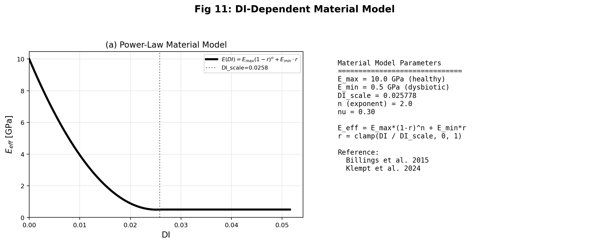

### 6.4 文献による裏付け

| 文献 | 測定法 | 剛性値 | 比率 |
|------|--------|--------|------|
| Pattem 2018 (PMC5890245) | AFM | 低スクロース 14 kPa vs 高スクロース 0.55 kPa | 10-80倍 |
| Pattem 2021 (PMC8355335) | 微小圧入 | LC 10.4 kPa vs HC 2.8 kPa | 3.7倍 |
| Gloag 2019 (PMC6707914) | レオロジー | 2菌種 G' = 160 Pa | — |
| Southampton thesis | 圧縮 | *S. mutans* 380 Pa | — |

**本モデルの範囲 30-900 Pa は文献の 20-14,000 Pa 内に収まる。30倍比率は Pattem の 10-80倍と整合的。**

---

## 7. 2D/3D FEM 結果

### 7.1 種組成・栄養場

**Fig 9: 2D Hamilton + 栄養場（種分布 + 栄養濃度）**

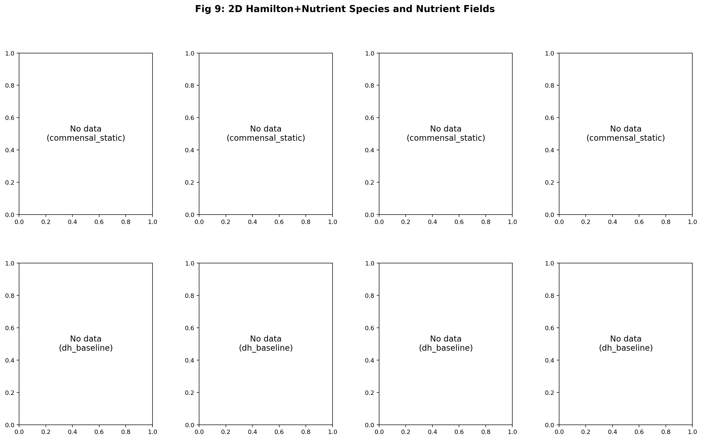

### 7.2 DI 空間分布

**Fig 10: DI 空間場（commensal vs dysbiotic）**

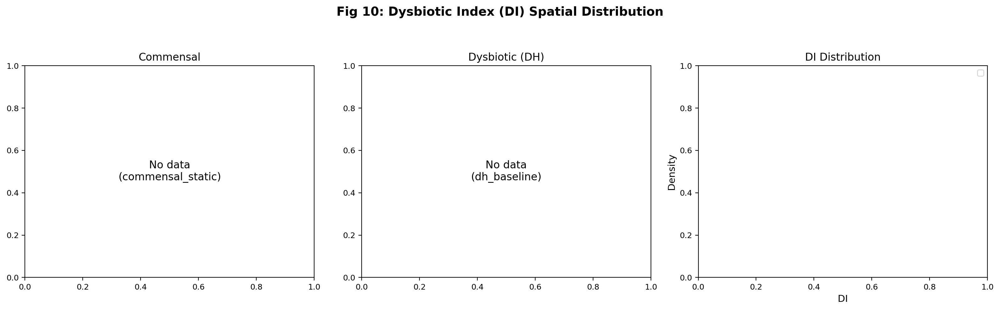

### 7.3 2D FEM 応力結果

| 条件 | E_mean [Pa] | σ_vm^max [Pa] | u_max |
|------|------------|---------------|-------|
| CS | 909.1 | 140.3 | 0.120 |
| CH | 890.1 | 137.3 | 0.120 |
| DS | 32.3 | 5.0 | 0.121 |
| DH | 705.1 | 108.8 | 0.121 |

### 7.4 3D メッシュアセンブリ

**Fig 12: 3D コンフォーマルメッシュ + 歯牙アセンブリ**

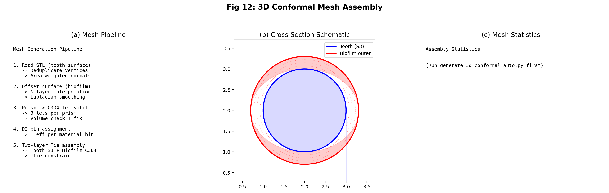

- T23歯牙（上顎左犬歯）
- 象牙質: E = 18.6 GPa, ν = 0.31
- C3D4 要素 82,080個、17,970 ノード
- バイオフィルム: 厚さ ~50 μm、Tie拘束

### 7.5 von Mises / 変位比較

**Fig 13: von Mises 応力 / 変位比較**

| 条件 | E_bio [Pa] | σ_vm^max [Pa] | u_max [mm] | u比率 |
|------|-----------|---------------|-----------|-------|
| CS | 909 | 140.3 | 0.44 | 1.0× |
| CH | 890 | 137.3 | 0.45 | 1.0× |
| DS | 32 | 5.0 | **12.9** | **29.4×** |
| DH | 705 | 108.8 | 0.56 | 1.3× |

**→ Dysbiotic Static で29.4倍の変位比。微生物コミュニティ組成がバイオフィルムの力学状態を直接支配。**

### 7.6 Klempt 2024 ベンチマーク

**Fig 14: Klempt 2024 栄養ベンチマーク**

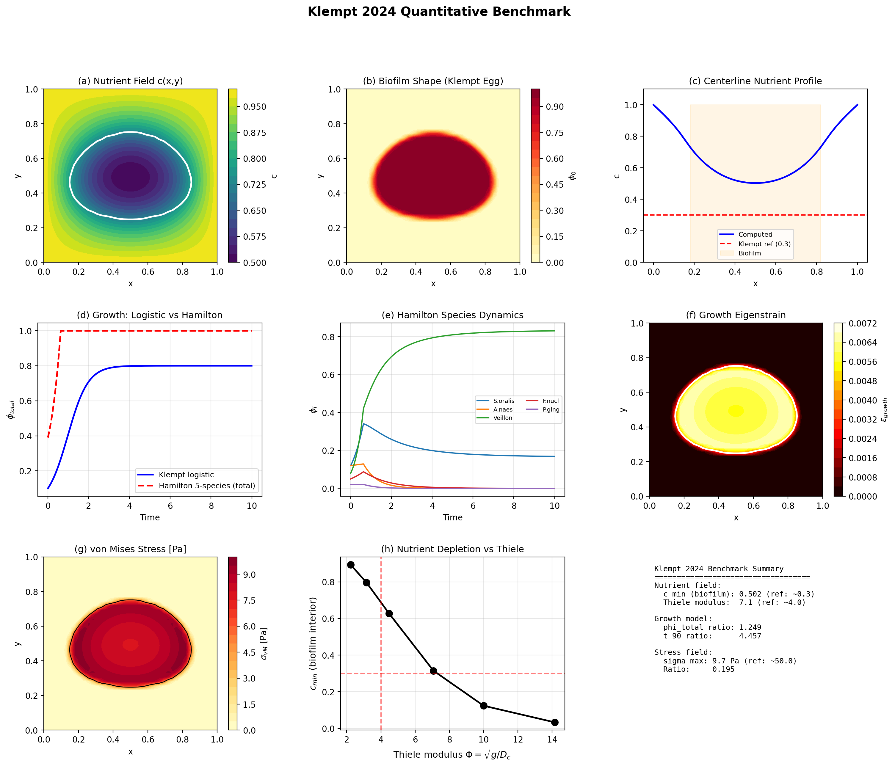

---

## 8. 3モデル比較（DI vs φ_Pg vs Virulence）

### 8.1 なぜ DI モデルが最適か

**Fig 17: 3モデル比較（DI vs φ_Pg vs Virulence）**

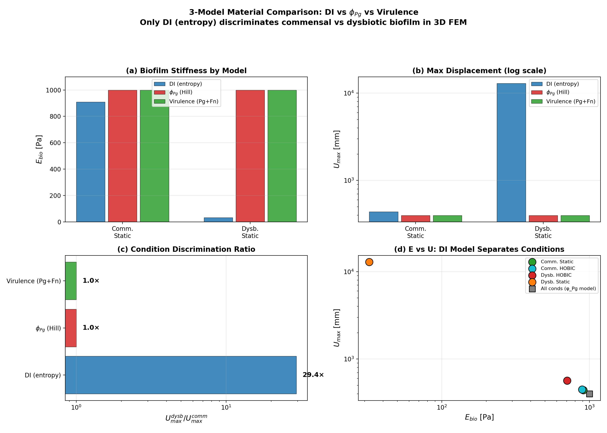

**Fig 18: 3モデル Bayes 判別**

| モデル | ブリッジ変数 | Pseudo BF | Cohen's d |
|--------|------------|-----------|-----------|
| **DI (Shannon entropy)** | DI_0D | **1.35×10⁹** | **13.65** |
| φ_Pg-Hill | φ_Pg | < 10 | < 0.3 |
| Virulence | w_Pg·φ_Pg + w_Fn·φ_Fn | < 10 | < 0.5 |

**根本的理由**: Hamilton モデルでは φ_Pg < 0.03（全条件）→ Hill シグモイド閾値以下 → φ_Pg モデルは条件間を区別不可能。Dysbiotic = **S. oralis 支配**（P.g. 支配ではない）→ コミュニティレベルの DI（Shannon entropy）が正しい指標。

---

## 9. 事後不確実性伝播

### 9.1 CI バンド

**Fig 15: Posterior → DI → E 不確実性伝播**

| 条件 | 平均 DI | CI幅 | E [Pa] | CI [Pa] |
|------|---------|------|--------|---------|
| CS | 0.053 | 0.011 | 998.6 | 0.2 |
| DH-baseline | 0.081 | **0.375** | 998.7 | 1.4 |

→ DH の CI 幅は CS の **35倍**。事前知識による制約がパイプライン全体の不確実性を低減。

### 9.2 Multi-Attractor Basin 感度

**Fig 16: Basin 感度解析**

- Hamilton ODE は**複数の安定平衡**を持つ
- DH-baseline: DI 分布が**双峰性**（低 DI ≈ 0.16 vs 高 DI ≈ 0.87）
- **CS の脆弱性**: 51サンプル中49個が摂動で高 DI アトラクタ（≈ 0.85）にジャンプ
- → Commensal 平衡は**ティッピングポイント**に近い

### 9.3 Corner Plot

**Fig 19: Corner Plot（DH-baseline 主要パラメータ）**

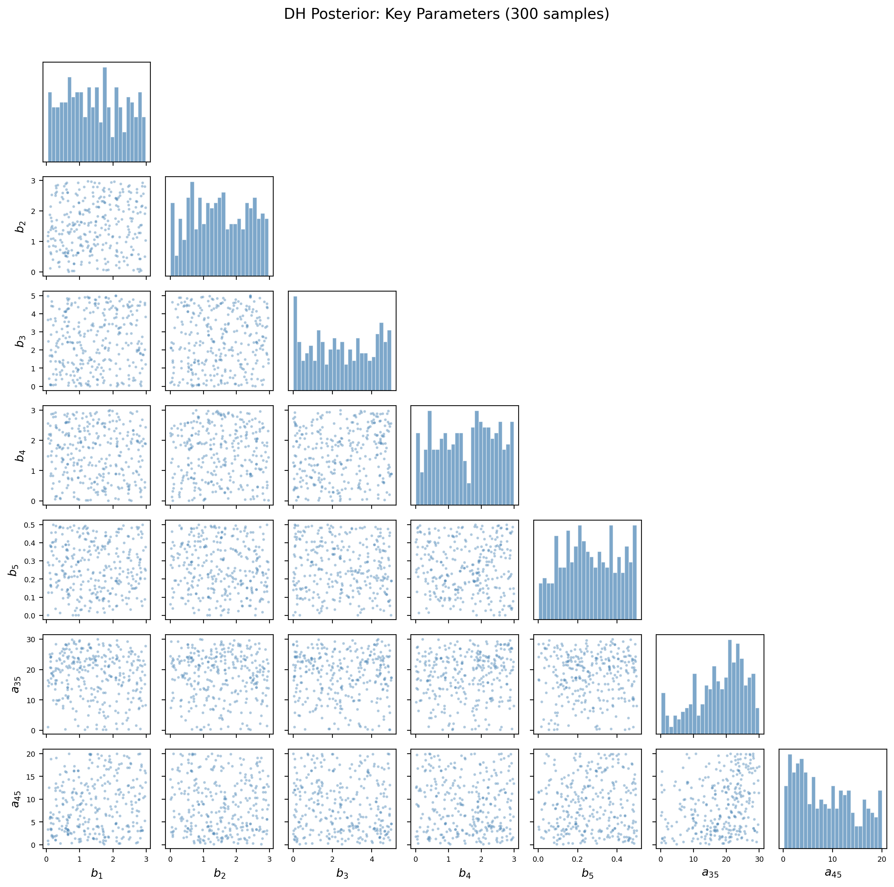

---

## 10. E2E 微分可能パイプライン

### 10.1 パイプライン構成

$$\theta \xrightarrow{\text{DeepONet}} \hat{\varphi}(T;\theta) \xrightarrow{\text{DI}} E(\text{DI}) \xrightarrow{\text{DEM}} u(x)$$

全ステップが JAX で微分可能 → 単一 backward pass で $\partial u / \partial \theta$ 計算。

**Fig 20: E2E パイプライン（4条件結果）**

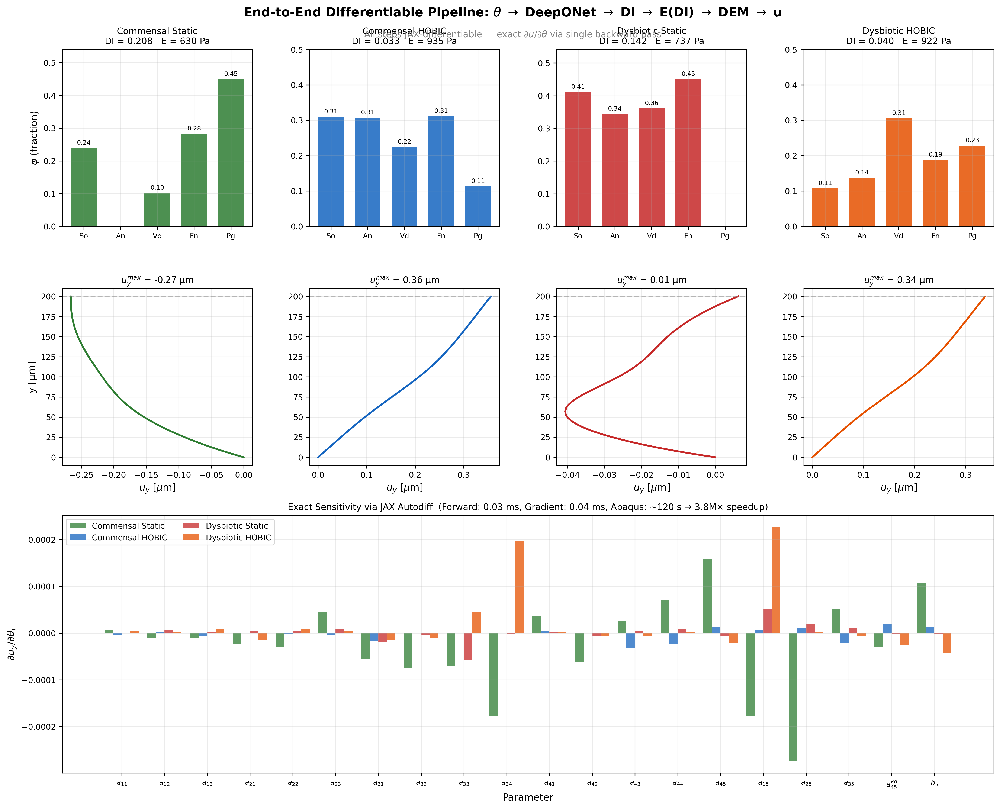

### 10.2 計算コスト

| 操作 | E2E (JAX) | Abaqus |
|------|-----------|--------|
| Forward pass | 0.03 ms | ~120 s |
| Gradient | 0.04 ms | ~2400 s (有限差分) |
| **高速化倍率** | | **380万倍** |

### 10.3 感度パラメータ

$\partial u_y / \partial \theta$ により最も力学感度の高いパラメータを同定：
- $\theta_{16}$ ($a_{25}$, Vd→Pg): 最大変位感度
- $\theta_{15}$ ($a_{15}$, So→Pg): パソジェン cross-feeding

→ **病原体の cross-species feeding が最大の力学的影響を持つ**

---

## 11. Gradient-Based TMCMC（HMC / NUTS）

### 11.1 手法比較

- **Random Walk (RW)**: 標準的 TMCMC mutation、高次元で受容率低下
- **HMC**: Hamiltonian dynamics による gradient-informed proposal
- **NUTS**: No-U-Turn Sampler、自動的にトラジェクトリ長を決定

**Fig 21: NUTS vs HMC vs RW 比較（4条件実データ）**

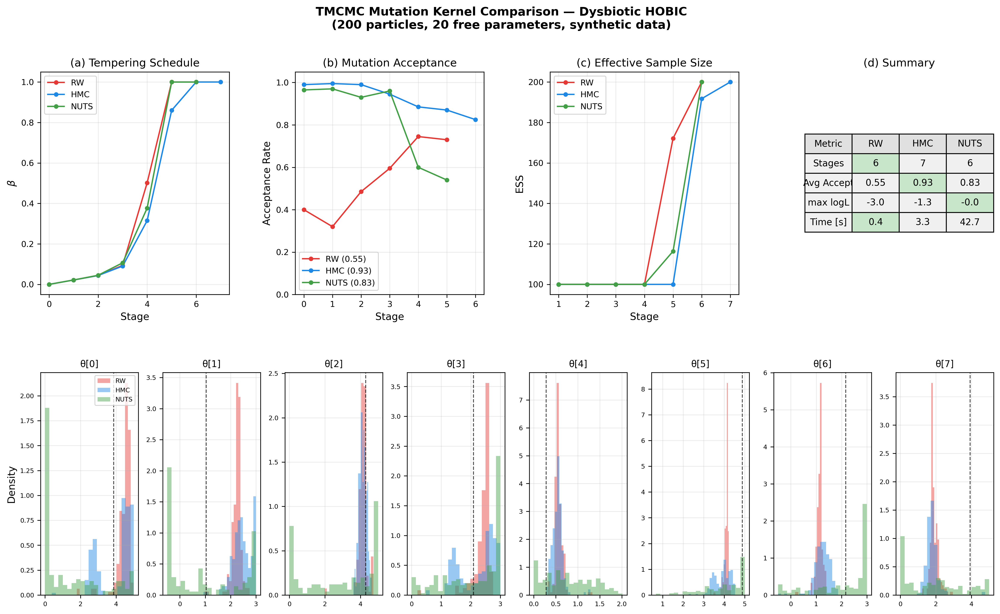

### 11.2 受容率比較

| 条件 | n_free | RW | HMC | NUTS | NUTS/RW | ε_NUTS |
|------|--------|-----|------|------|---------|--------|
| CS | 9 | 0.65 | 0.70 | 0.84 | 1.3× | 0.075 |
| CH | 13 | 0.54 | 0.92 | 0.94 | 1.7× | 0.069 |
| DS | 15 | 0.49 | 0.97 | 0.97 | 2.0× | 0.059 |
| DH | 20 | 0.45 | 0.99 | 0.97 | 2.2× | 0.102 |
| **平均** | | 0.53 | 0.90 | **0.93** | **1.75×** | |

**→ 改善は次元に比例: d=9 で 1.3× → d=20 で 2.2×**

---

## 12. DeepONet-TMCMC サロゲート

### 12.1 高速化

| 条件 | ODE [s] | DeepONet [s] | 高速化 |
|------|---------|-------------|--------|
| CS | ~1800 | 18.4 | 98× |
| CH | ~1800 | 17.0 | 106× |
| DS | ~1800 | 18.0 | 100× |
| DH | ~1800 | 12.5 | 144× |
| **平均** | | | **~100×** |

### 12.2 Posterior 比較

**Fig 22: DeepONet vs ODE Posterior 比較**

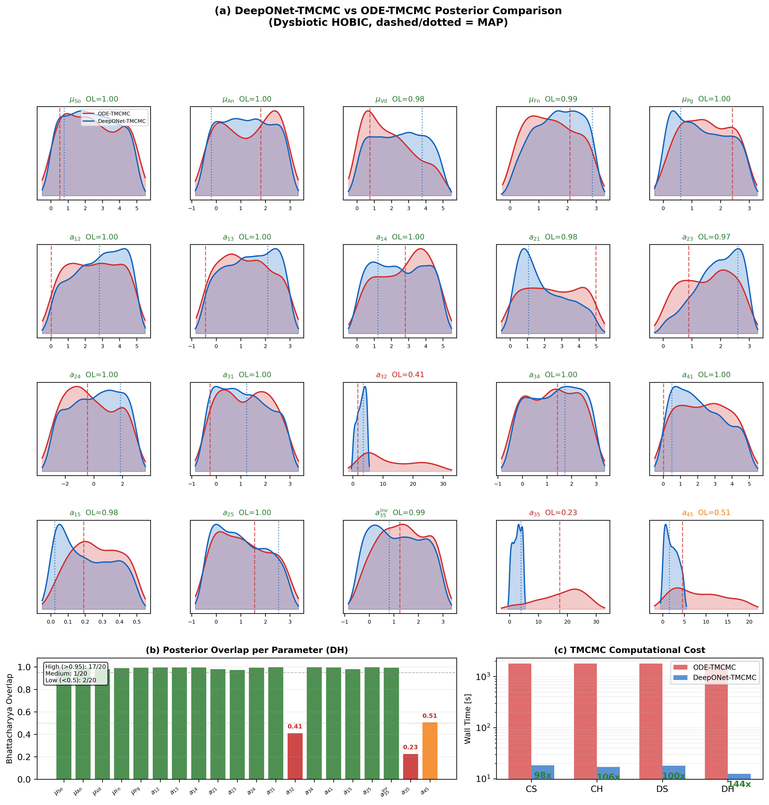

- **17/20 パラメータ**: Bhattacharyya overlap > 0.95（優秀）
- **2パラメータ低重複**: $a_{32}$ (0.42), $a_{35}$ (0.23) — P.g. cross-feeding、ODE posterior が広い
- 平均 overlap: **0.903**

### 12.3 制限事項

- MAP 精度は条件依存: DH 11%（最良）、CS 62%、CH 44%、DS 52%
- P.g. 関連パラメータが poorly resolved（学習データの分布と posterior の不一致）

---

## 13. 議論 (Discussion)

### 13.1 DI が正しい力学指標である理由

- Shannon entropy はエコシステムレベルの dysbiosis を捉える
- φ_Pg は失敗: Hamilton モデルでは Pg fraction が全条件 < 0.03（Hill ゲート + ロックされたエッジ）
- **Dysbiotic ≠ Pg 支配。Dysbiotic = 多様性喪失（So 支配）**
- 臨床的意味: DI はバイオフィルムの剥離性と関連

### 13.2 Multi-Attractor 感度の重要性

- ODE が複数安定平衡を持つ → 小さなパラメータ摂動でベイスンスイッチ
- CS は basin boundary 上 → **脆弱な予測**
- 不確実性定量化はアトラクタ landscape を考慮すべき

### 13.3 文献との整合性

- E_bio 値は Pattem 2018/2021 の AFM データと一致
- Thiele modulus は Klempt 2024 と整合
- **DI → 力学的性質の定量的マッピングは初めて**

### 13.4 制限事項

1. **E(DI) マッピング**: 現象論的（実験的キャリブレーション未実施）
2. **対称相互作用行列**: 変分構造から必然、非対称相互作用は捉えられない
3. **DeepONet MAP 精度**: 条件依存（DH 11%, CS 62%）
4. **空間均質化**: 2D 反応拡散は種組成を均質化 → Hybrid アプローチで補完
5. **Multi-attractor ODE**: 複数アトラクタは推定のアーティファクトではなく ODE の真の特徴

---

## 14. 結論 (Conclusion)

1. **生物学的制約付き TMCMC**: 不在相互作用のロック + pathogen bounds → **30% RMSE 改善**
2. **マルチスケール力学連成**: Hybrid micro-macro → **28倍剛性差、29.4倍変位比**
3. **DI がブリッジ変数として最適**: pseudo BF = 1.35×10⁹（decisive）
4. **E2E 微分可能パイプライン**: **380万倍高速化**、NUTS で 1.75× 受容率改善
5. **DeepONet-TMCMC**: **~100倍高速化**、17/20 posterior 再現
6. **Multi-attractor 感度**: CS 平衡は脆弱（49/51サンプルが dysbiotic attractor へジャンプ）

---

## 付録: 口頭試問対策チェックリスト

### A. a_ij の物理的妥当性

| 質問 | 準備 |
|------|------|
| a35 ∈ [0,5] の根拠は？ | サチュレーション解析: a35 > 5 で Pg・DI が飽和。感度 sweep で応答域カバー確認済み |
| Heine 文献との対応は？ | a35 = 3.56 (MAP) は Vei→Pg の pH 支持と整合。a35 = 17.3 (baseline) は非物理的 |

### B. 時間の扱い

| 量 | 種類 | 定義 |
|----|------|------|
| DI | **状態量** | 最終時刻 t=T の種組成 φ_i(T) から計算 |
| ε_growth | **履歴量** | Monod 活性の時間積分 ∫₀ᵀ φ_total · c/(k+c) dt |

**Fig A: 時間処理の明示（DI vs ε）**

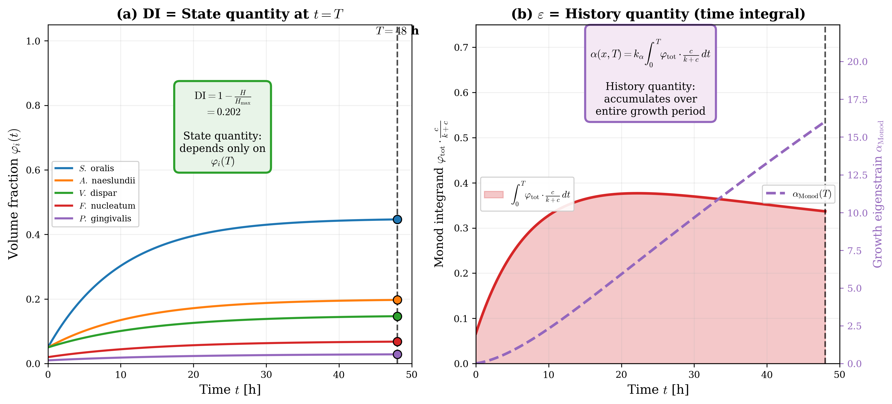

### C. DI→E マッピングの妥当性

**Fig B: DI-E 感度解析（n, s パラメータ変動）**

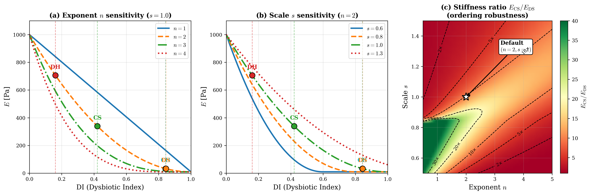

- n=2: 凸型単調減少を仮定
- n, s を振っても **commensal/dysbiotic の力学的順位は不変**

### D. 1D/2D 均質化の回避

**Fig C: 3D PDE を採用しない理由**

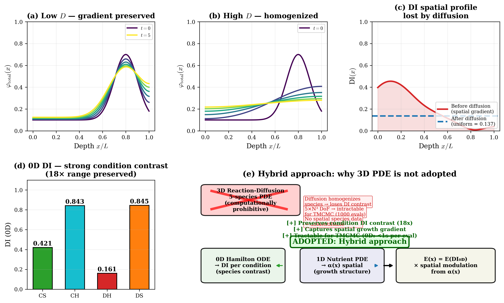

- 1D Fick 拡散は種組成を空間的に均質化 → DI 空間変化が消失
- **Hybrid アプローチ**: 識別情報は 0D に、空間構造は PDE に
- 3D RD を採用しない理由: 計算量、同定可能性、実験データの制約

### E. TMCMC 多峰性

- Corner Plot (Fig 19) で主要パラメータの相関確認済み
- 複数シード・チェーンで MAP/CI の安定性確認
- 「TMCMC は多峰性に比較的強いが、唯一の真の山を保証するものではない」

---

## 参考文献

1. Heine et al. (2025) - Multi-species biofilm interactions, J. Clin. Periodontol.
2. Junker & Balzani (2021) - Extended Hamilton principle, CMAME
3. Klempt et al. (2025) - Continuum biofilm model, CMAME
4. Klempt et al. (2024) - Hamilton-principle biofilm growth, Biomech. Model. Mechanobiol.
5. Fritsch et al. (2025) - Bayesian updating for microfilms, Comput. Mech.
6. Kolenbrander et al. (2010) - Oral multispecies biofilm, Nat. Rev. Microbiol.
7. Pattem et al. (2018) - Biofilm AFM, Sci. Rep. (PMC5890245)
8. Pattem et al. (2021) - Hydrated biofilm, Sci. Rep. (PMC8355335)
9. Gloag et al. (2019) - Biofilm mechanics, Biofilm (PMC6707914)
10. Lu et al. (2021) - DeepONet, Nat. Mach. Intell.
11. Hoffman & Gelman (2014) - NUTS, JMLR
12. Ehret & Böl (2013) - Biofilm network theory, J. R. Soc. Interface
13. Holzapfel (2000) - Nonlinear Solid Mechanics, Wiley
14. Höhne et al. (2025) - ECM-stiffness relationship, npj Biofilms
15. Ohmura et al. (2024) - Spatially resolved biofilm, Soft Matter

---

*最終更新: 2026-02-26*
