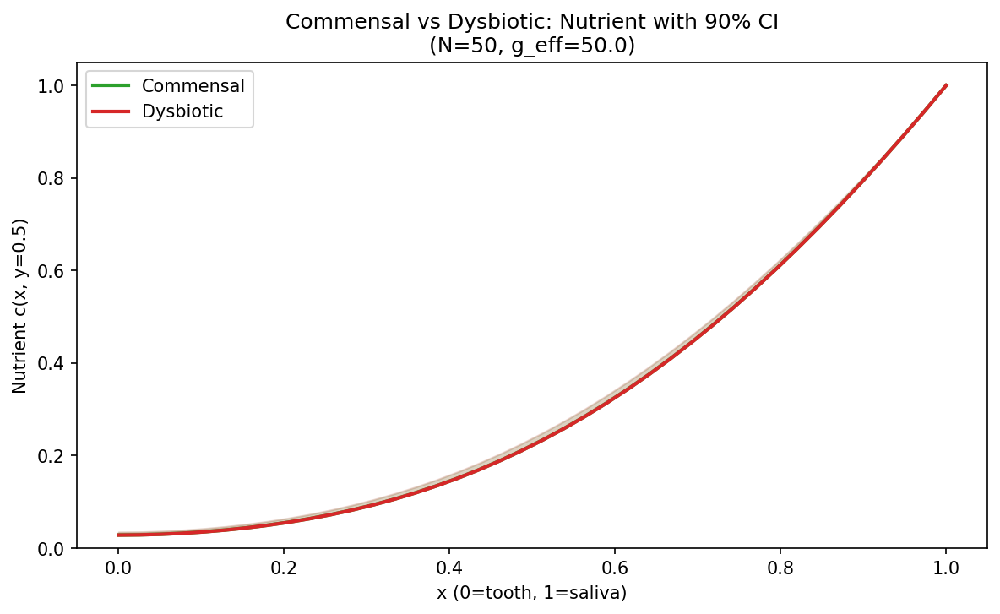
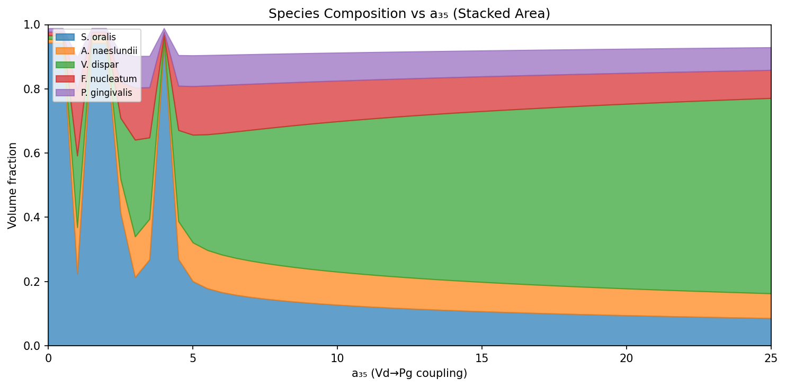

# Results by Category

Results Gallery reorganized by analysis category. Same figures, clearer structure.

> See also: [Results Gallery](Results-Gallery) (chronological), [TMCMC Per-Condition](TMCMC-Per-Condition), [FEM Spatial Analysis](FEM-Spatial-Analysis), [Uncertainty & Mechanics](Uncertainty-and-Mechanics)

---

## 1. TMCMC Bayesian Inference

Best runs: 2026-02-08, 1000 particles, ~90 h per condition.

### MAP RMSE Summary

| Species | Comm. Static | Comm. HOBIC | Dysb. Static | Dysb. HOBIC |
|---------|:-----------:|:-----------:|:-----------:|:-----------:|
| *S. oralis* | 0.0935 | 0.1044 | 0.0256 | 0.0416 |
| *A. naeslundii* | 0.0422 | 0.0807 | 0.0566 | 0.0706 |
| *V. dispar* | 0.0604 | 0.0458 | 0.0748 | 0.1069 |
| *F. nucleatum* | 0.0210 | 0.0137 | 0.0291 | 0.0807 |
| *P. gingivalis* | 0.0191 | 0.0169 | 0.0645 | 0.0562 |
| **Total** | **0.0547** | **0.0632** | **0.0538** | **0.0746** |

### Interaction Network

Inferred 5-species interaction network (Dysbiotic HOBIC). Blue = facilitation, red = inhibition. a₃₅ (Vd→Pg) and a₄₅ (Fn→Pg) confirm bridge-mediated dysbiosis.

### MAP Fits — All 4 Conditions

| Commensal Static | Commensal HOBIC |
|:---:|:---:|
|  |  |
| Pg suppressed. a₃₅≈0, a₄₅≈0. | HOBIC flow, Pg still low. |

| Dysbiotic Static | Dysbiotic HOBIC |
|:---:|:---:|
|  |  |
| Pg surge at ~100 h via bridge facilitation. | Strongest Pg surge under flow. |

### Posterior Predictive Bands

| Commensal Static | Commensal HOBIC |
|:---:|:---:|
|  |  |

| Dysbiotic Static | Dysbiotic HOBIC |
|:---:|:---:|
|  |  |

90% credible intervals from 1000 posterior samples. Uncertainty widest for bridge organisms in dysbiotic conditions.

### Interaction Heatmaps

| Dysbiotic Static | Dysbiotic HOBIC |
|:---:|:---:|
|  |  |

Row = influenced species, column = influencing species. Large a₃₅/a₄₅ in dysbiotic conditions.

### TMCMC Convergence

Tempering schedule β₀→β_J=1. Smooth progression = good annealing.

---

## 2. 3D FEM Spatial Fields

Hamilton ODE → depth-dependent composition → Open-Full-Jaw mesh (40k elements).

### P. gingivalis — All 4 Conditions

φ_Pg across all conditions. Dysbiotic HOBIC (bottom-right) = highest Pg penetration.

### Dysbiotic Index — Cross-Condition

DI depth profiles with 90% CI. Higher DI = more dysbiotic near tooth surface.

### DI Spatial Field — Dysbiotic HOBIC (3D)

3D DI field on the tooth model.

---

## 3. Stress & Uncertainty Quantification

20 TMCMC posterior samples per condition → full FEM pipeline → stress distribution.

### Stress Distributions

Von Mises stress violin plots. dh-baseline = widest spread (1.58×) due to unconstrained a₃₅.

### Stress Summary Panel

6-panel: box plots, sensitivity (Spearman ρ), CI bars, relative change vs. commensal static.

### Material Sensitivity

Effect of E_max / E_min / n on S_Mises. Approximately linear in E_max.

---

## 4. Multiscale Micro→Macro Coupling

0D ODE → DI_0D → 1D nutrient PDE → α_Monod(x) → ε_growth(x) → Abaqus.

### Key Metrics

| Condition | DI_0D | E_eff (Pa) |
|-----------|:-----:|:----------:|
| Commensal | 0.047 | ~909 |
| Dysbiotic | 0.845 | ~33 |
| **Ratio** | **18×** | **28×** |

| Depth | α_Monod | ε_growth |
|-------|:-------:|:--------:|
| x=0 (tooth) | 0.004 | ~0% |
| x=1 (saliva) | 0.420 | 14% |
| **Gradient** | **101×** | **101×** |

### Pipeline Summary

9-panel overview: DI_0D, nutrient c(x), species φᵢ(x), α_Monod(x), ε_growth(x), E(x).

### Multiscale Comparison

Side-by-side: 0D trajectories, 1D nutrient + species, eigenstrain for commensal vs dysbiotic.

---

## 5. 2D Nutrient PDE

Hamilton 0D → 2D depth profile → steady-state Klempt PDE (40×40 grid, g_eff=50).

### 2D Heatmap Comparison

Left: φ_total(x,y). Center: c(x,y). Right: Pg. Top = Commensal, Bottom = Dysbiotic. Pg max ratio = **5.7×**.

### Cross-Section (y = 0.5)

1D slices from 2D simulation. ODE trajectories, composition bar, depth profiles, nutrient sensitivity sweep.

### Condition Difference Maps

Δ(Dysbiotic − Commensal). Pg difference concentrated at tooth surface (x≈0), max Δφ_Pg ≈ 0.04.

### Summary

| Metric | Commensal | Dysbiotic | Ratio |
|--------|:---------:|:---------:|:-----:|
| φ_total mean | 0.368 | 0.354 | 0.96 |
| c(tooth, y=0.5) | 0.028 | 0.031 | 1.09 |
| Thiele mod | 4.29 | 4.21 | 0.98 |
| **Pg max** | **0.0085** | **0.0484** | **5.7×** |

---

## 6. Posterior → Nutrient Uncertainty

50 posterior samples/condition → Hamilton 0D (T*=25) → 2D profile → nutrient PDE → c_min.

### c_min Distribution

Bimodal: most samples → Vd-dominated equilibrium (c_min ≈ 0.028), secondary mode → Pg-enriched (c_min ≈ 0.034). Conditions overlap — c_min driven by total biomass, not composition.

### Spatial Credible Bands

y = Ly/2 cross-section with 90% CI. Two conditions nearly indistinguishable.

### Parameter Sensitivity

**a₃₃ (Vd self-interaction) = strongest driver** (ρ ≈ −0.5). a₃₅/a₄₅ weaker (ρ ≈ 0.2–0.3).

### 2D Uncertainty Map

Top: median c(x,y). Bottom: 90% CI width. Max uncertainty (~0.015) at mid-depth.

### Summary

| Metric | Commensal | Dysbiotic |
|--------|:---------:|:---------:|
| c_min MAP | 0.028 | 0.028 |
| c_min 90% CI | [0.028, 0.035] | [0.028, 0.035] |
| Top sensitivity | a₃₃ (ρ=−0.46) | a₃₃ (ρ=−0.50) |

**Key insight**: Nutrient depletion is controlled by total biomass (Vd-dominated), not dysbiotic composition. The DI→eigenstrain pathway is necessary for mechanical discrimination.

---

## 7. a₃₅ Sweep — Phase Transition Analysis

a₃₅ swept 0→25 at Dysbiotic Static MAP (19 other params fixed). 51 points, T*=25, g_eff=50.

### 4-Panel Overview

Pg peaks at a₃₅ ≈ 1 then saturates. c_min responds weakly. DI shows sharp transition at a₃₅ ≈ 1–4.

### Species Composition Phase Diagram

Three regimes:
- **a₃₅ = 0–1**: Vd-dominated (~80%), minimal Pg.
- **a₃₅ ≈ 1–4**: **Critical transition** — species reorganization, oscillatory behavior, bifurcation.
- **a₃₅ > 5**: Fn-dominant (~50%), Pg moderate (~7–10%).

### Dual-Axis: Pg & c_min

Pg and c_min track together. Bifurcation zone (a₃₅ ≈ 1–4) visible as oscillations.

### Regime Summary

| a₃₅ | Regime | Pg | DI | c_min |
|:---:|--------|:--:|:--:|:-----:|
| 0–1 | Vd-dominated | 0.01 | 0.85 | 0.028 |
| 1–4 | **Bifurcation** | 0.05–0.10 | 0.02–0.85 | 0.028–0.035 |
| 5–25 | Fn/Pg stable | 0.07–0.10 | 0.02–0.30 | 0.032–0.035 |

**Key insights**:
1. a₃₅ triggers a *community phase transition*, not monotonic Pg increase
2. Bifurcation zone = multiple coexisting equilibria (ecological regime shift)
3. c_min is robust to a₃₅ (20% variation over 0–25 range)

---

## Run Directories

| Condition | Directory |
|-----------|-----------|
| Commensal Static | `data_5species/_runs/Commensal_Static_20260208_002100/` |
| Commensal HOBIC | `data_5species/_runs/Commensal_HOBIC_20260208_002100/` |
| Dysbiotic Static | `data_5species/_runs/Dysbiotic_Static_20260207_203752/` |
| Dysbiotic HOBIC | `data_5species/_runs/Dysbiotic_HOBIC_20260208_002100/` |
